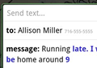
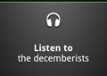
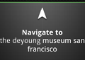
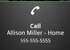
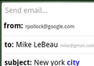
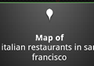
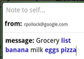
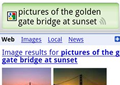

Now you can control your Android phone just by speaking using ‘Voice Actions’. This feature is unveiled at a press event at its San Francisco office in spite of rumors on [Video Calling](http://www.cosmogeek.info/2010/08/will-google-reveal-video-calling-at.html).

You require Android 2.2 (Froyo) and higher for these features -

-  **Send text messages**
    
    Say "_send text to_ \[recipient\] \[message\]\*"
    
    e.g. "send text to Allison Miller Running late. I will be home around 9"
    
-  **Listen to music**
    
    Say "_listen to_ \[artist/song/album\]"
    
    e.g. "listen to the decemberists"
    
-  **Get directions**
    
    Say "_navigate to_ \[address/city/business name\]"
    
    e.g. "navigate to the DeYoung Museum San Francisco" or "navigate to 1965 Page St."
    
-  **Call businesses**
    
    Say "_call_ \[business name\] \[location\]\*"
    
    e.g. "call Pizzeria Venti Mountain View"
    
-  **Call contacts**
    
    Say "_call_ \[contact name\] \[phone type\]\*"
    
    e.g. "call Allison Miller home"
    
-  **Send email**
    
    Say "_send email to_ \[recipient\] \[subject\]\* \[body\]\*"
    
    e.g. "send email to Mike LeBeau How's life in New York treating you? The weather's beautiful here!"
    
-  **View a map**
    
    Say "_map of_ \[address/city\]"
    
    e.g. "map of San Francisco"
    
-  **Go to websites**
    
    Say "_go to_ \[website\]
    
    e.g. "go to Wikipedia"
    
-  **Write a note**
    
    Say "_note to self_ \[message\]"
    
    e.g. "note to self grocery list banana milk eggs pizza"
    
-  **Search Google**
    
    Say "\[your query\]"
    
    e.g. "pictures of the golden gate bridge at sunset"
