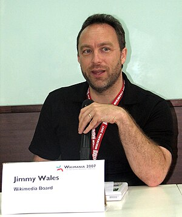

Image via [Wikipedia](http://commons.wikipedia.org/wiki/File:Wm2007_press_002.jpg)

The owner of the online encyclopaedia, **Wikipedia**, plans to open an office in **India**, first office outside the US, says Wikimedia Foundation co-founder, **Jimmy Wales.**

He told the Indian website, CIOL, that no location had been chosen yet, but the office would open within several months.

Europe and Africa had been considered as possible locations. But Europe was already highly developed and there were concerns about the technical capabilities in Africa, he said.

“India was in the middle of the two extremes," said Mr Wales. "It is a growth region and I also like the enthusiasm in the country."

"We hope to support Indians to realise the vision of a world in which every single person can freely share in the sum of all knowledge," he said in e-mailed comments.

\[via\] BBC
