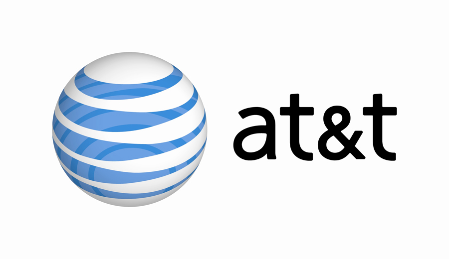

**AT&T** said it entered a definitive agreement with **Deutsche Telekom AG (DTE)** to acquire **T- Mobile USA** in a cash-and-stock transaction currently valued at approximately $39 billion a few minutes ago.  
The agreement has been approved by the Boards of Directors of both companies, Deutsche Telekom said in a statement.  

  
  
  
AT&T’s acquisition of T-Mobile USA provides an optimal combination of network assets to add capacity sooner than any alternative, and it provides an opportunity to improve network quality in the near term for both companies’ customers. In addition, it provides a fast, efficient and certain solution to the impending exhaustion of wireless spectrum in some markets, which limits both companies’ ability to meet the ongoing explosive demand for mobile broadband.  
Read full agreement details [here](http://www.mobilizeeverything.com/home.php).
