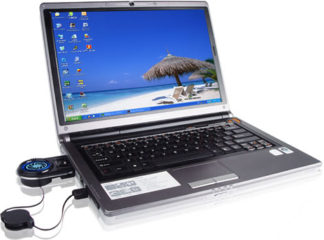

  
  
Buying a new laptop is often confusing for many of us if we’re not tech savvy enough to understand all the jargon or just plain don’t know the requirements we are looking for. With that in mind we’ve put together a brief guide to choosing yourself a laptop which should make it easier for you to end up with the right model for you.  
  
**Defining your usage**  
This is the most important step in buying a laptop as many people buy laptops that either exceed or do not meet their requirements. Buying a poor quality laptop will end up costing you more in the long run and buying too high a quality laptop is simply a waste of money. So you need to determine your usage. If you mainly use your laptop for work, email etc then you can get by with a very low end computer as you don’t require a lot of memory or performance based hardware. If you want a laptop for digital design or gaming then you will need a much higher performance, a good graphics card and a lot of memory. If you use your computer as your primary media device then you will also want a good quality sound card and a high quality screen. If you determine your usage in this way you should be able to have a much better idea of what you need.  
                Secondly you need to determine how mobile you want your laptop to be. If you intend to travel with it extensively for work or require something with a long battery life for extended trips away then you need to analyse these requirements. Generally this information will be clear but always minus a few hours from the battery life as this tends to be a best case figure. Sacrificing size for battery life or vice versa is worth considering depending on your needs.  
  
**Jargon busting**  
The biggest hurdle in understanding which laptop to buy is cutting through the jargon. The most important things to examine in this area are RAM and hard drive capacity. RAM determines the processing speed of your computer and should be at least 256MB whatever your intended usage. Your hard drive capacity determines how much storage space is available on your computer and is measured in GB or gigabytes. The amount of storage you need entirely depends on your use as a word document takes up a tiny fraction of space whilst a design program like Dreamweaver will take up considerably more. So stick to a size that will exceed your use by no more than 20%. If you want a computer for media then you will need more size, a good soundcard and most importantly a DVD player. If you intend use the computer for gaming then make sure you have lots of memory and RAM and a graphics card that can handle your games.  
  
**Research**  
Now that you have your usage outlined its time to research the computers themselves. The best pace to do this is online where you can look at and compare specs and read user reviews. Pay attention to battery life and look at common problems with the models you are examining so you can determine the quality of the purchase. When you find a few models that are likely candidates it’s time to do the actual shopping. If you [shop online](http://www.shopandearn.com.au/ "Shop Online With Shopandearn.com.au") you can normally save a lot of money but make sure you check mail costs etc and the returns policy. The best places to shop for computers are price comparison sites as you can see the relative cost from a variety of stockists.  

Steve writes about products within the technology industry, in addition to using shopping portals such as [ShopAndEarn.com.au](http://www.shopandearn.com.au/ "ShopAndEarn.com for Online Shopping in Australia ") where you can earn rewards for items purchased online.
