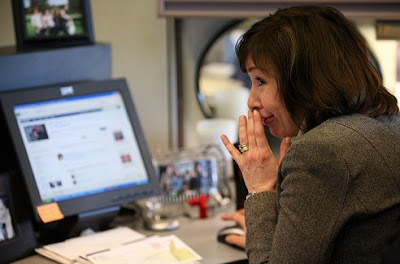

Sure, Facebook is a great tool to use when you are updating your family members, or keeping in touch with your friends. Or, as some students put it, “Facebook Stalk” their friends. It's great to upload pictures, chat with longtime friends that life faraway, and write on people's walls. Sometimes, going on Facebook is also a great break. It could be a great break from a long homework assignment, or it can also be a good break from your work. Let's face it, people can't work 8 long hours without some sort of break. Going on Facebook is considered an acceptable form of a break. It can break the monotony. However, there are also some things that need to be considered when you go on Facebook.  
  

  
  
If it is a slow day at the office, it is very tempting to update your status about that. You must be careful though, you might have forgotten that you accepted the friend request from your boss. Along with all of your other friends, your boss will be able to see your status updates. Even if you are able to change your security settings so that your boss can't see it, it is most likely that your co-workers will see it. Don't forget the 5 degrees of social circles. According to this, you are connected to someone by 5 relationships or less, so watch what you say on Facebook. Your best friend may be good friends with your bosses' daughter―you never know!  
  
Here are 5 status updates that you should try to avoid at all costs:  
  
**1) Is wondering how _insert your bosses name here_ got their jobs as manager.**  
Don't be putting down your boss―even if you don't like them. It will come back to you―so if you must rant about your boss―write about it in your journal. Keep it to yourself.  
  
**2) Feels like I am going to catch a cold tomorrow―achoo!**  
Telling the Facebook world about how you are going to fake a cold is going to damage your credibility. The next time you actually do get sick, who is going to believe the worker that lied about it before?  
  
**3) Why does my _insert co-workers name here_ DO that?!?!?**  
Keep your comments about what your co-workers do to yourself. Sure, they may like to eat something that smells, but chances are, you do something that bugs them too!  
  
**4) Wants _insert your bosses name here_ to fall off a cliff.**   
Even if it a joke, it's not a good idea to wish your boss a timely death. You wouldn't want your boss to see that, so why post it?  
  
**5) Is going out for lunch―and hopefully some shopping. Lunch may be longer than expected!!**  
Sure, you can do what you want on your lunch break, but advertising that you will take longer and don't really care, sends the wrong message about where you work.  
  
Whatever you like to do outside of work is great, just be careful of what photos and status updates. If you like to drink, don't tell everyone about it. It's better to stay on the cautious side. It is reported that up to 8% of those that are fired are because of “misuse of social media.” Why put your job in jeopardy? Your updates about your crazy night and how hungover you are can wait. In this economy, you don't want to lose your job over a silly status update. Keep your statuses fun, but don't reveal too much information.  
  

_About the Author_  
_Neltje Maynez is a free-lance writer for MyCollegesandCareers.com. [My Colleges and Careers](http://www.mycollegesandcareers.com/) is a great tool for those that are deciding whether to continue their education. From there, they can choose which [online masters degree programs](http://www.mycollegesandcareers.com/online-degrees/online-masters-degrees/) are the best fit for them._
