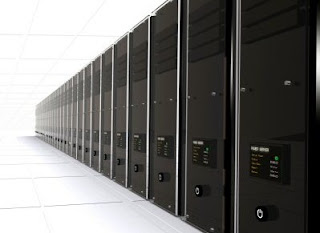

  

  

Why you need to back up your data  
  
A surprising number of individuals do not back up their computer data. Such people often assume it would take too much effort to make backups. They might also think that data loss will simply never happen to them. If data loss has not happened to them before, they might not be worried. They should be. Data loss can and does strike without warning, from many directions. Among the causes of data loss are human error, hardware malfunctions, software bugs, hardware age, and physical accidents. Of course there is also always the case of a malicious enemy or angry ex who manually wipes your hard drive. Don't be a fool. Back up your data.  
  
  
  
  
Traditional ways to make backups  
  
There are many traditional backup solutions. One simple way to make a backup is to save all your data files to flash drives or CDs. With large quantities of data, external hard drives are usually a better choice. Many computer users go a step further and make bootable backups. Bootable backups contain not only data files but also software program files. So they are basically clones of entire computers that exist on external hard drives. Bootable backups tend to take a good deal of time to create, but for many users the time is well worth it.  
  
Where traditional backups fall short  
  
Traditional backups fall short because they have a physical component. If you put your data on a flash drive and then proceed to lose the flash drive, you have lost your backup. The same can be said for backups that exist on CDs, DVDs, or external hard drives. Any physical device is susceptible to destruction or malfunction. Some forms of data storage also have time limits. For example, most DVDs are only expected to hold their data for seven years. After that time frame, any data on the disk could become corrupted.  
  
Online backups provide the answer  
  
Backing up data online solves the problems associated with traditional backups. When your data is stored in an online cloud, it cannot be destroyed by fire, water, or wind. It does not have the same time constraints of physical storage. People with online backups also save money on hardware. They do not have to continually buy new hard drives when their space runs out. Online backups provide an efficient, cost-effective security net for user data.  
  
More advantages of online backups  
  
Another major advantage of online backups is that they are accesible from anywhere in the world. As long as users have access to computers with internet, they can download their data. This quality can make travelling lighter because users do not have to bring their computer hardware with them if they do not wish to. Since tourists are often targets for theft, leaving the computer at home can be a wise decision.  
  
How to choose an online backup provider  
  
Users have many online backup providers to choose from. Each user must choose the provider that will best meet their individualized needs. Costs vary based on quantity of data backed up and other considerations. Users should think about both how much data they intend to back up and how frequently they expect to back it up. Some providers automatically make backups behind the scenes, while other may require users to manually start each backup process. Lastly, anyone considering an agreement with an online backup provider should verify that the provider is a legitimate business with an established track record. Taking time to read online reviews and business rankings can help ensure the best decision is made.  
  

_This article is written by Jen Silva.  Jen works for ChooseWhat.com and is interested in various small business resource topics such as how to [start a business](http://www.choosewhat.com/), how to build a website, and how to order [business cards](http://business-cards.choosewhat.com/) online. Visit ChooseWhat.com to read great articles for those interested in small business tools and resources._
