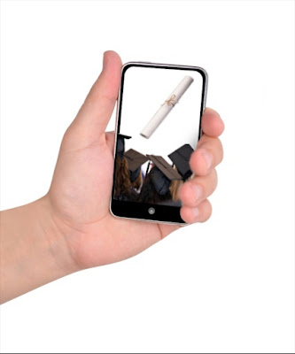

A life in college is a life filled with adventure, responsibility, and new experiences. What better way to maximize your time, efforts, and abilities with the use of improving technologies in mobile apps? Whither in medical school, the arts, or [technology colleges](http://www.technology-colleges.info/), students can benefit from the latest in mobile technology. Get organized, get ready, and get serious about your college experience with the Top Ten Mobile Apps for College Students.  

  
**Get Organized**  
**1\.      Evernote**  
Make the most out of every experience with supreme organization and a mobile app that lets you gather information, take notes, and index your information into easily searchable notebooks. This app allows you to save and organize text, photos, screenshots, and audio recordings and can be used on mobile devices or on laptops and computers.  
  
**2\.       iStudiez Pro**  
Available on all Apple devices, this powerful academic planner helps students track time commitments, classes, and assignments from their mobile device. Perfect for rigorous online courses, this affordable app can create a personalized schedule with nifty color coding and icons.  
  
**3\.      Drop Box**  
Don’t be caught without your homework. Backing up your assignments to the convenient file system at Drop Box means you can access your files from home, from school, and from your phone. Save audio, photos, and text. The information is instantly available to all your mobile devices and equipment.  
  
**Get Ready**  
**4\.      Tweetdeck**  
Forget individual apps for each social media site. With Facebook, Twitter, and Google apps cluttering up your phone, choose the easier way with Tweetdeck. A powerful app that combines all the data from your social media sites into one interface, Tweetdeck makes it easy to manage your social connections without missing a social beat.  
  
**5\.      Wi-Fi Finder**  
On a road-trip to adventure and lost your lifeline to society? Always be prepared with the Wi-Fi Finder, an app that utilizes your GPS location to bring up nearby networks, directions, and contact information.  
  
**6\.      Gasbag**  
Getting gas can be a painful necessity when riding your bike or taking the bus isn’t an option. Keep your costs manageable with Gasbag, a search app that helps you save serious cash on gas prices. Find the best and lowest prices in your area.  
  
**Get Serious**  
**7\.       Dictionary.com**  
Never be at a loss for words again with over 1 million words at your disposal. Ranked as the #1 app for college students by the U.S. News & World Report, Dictionary.com includes audio pronunciation, examples, origins, and word history.  
  
**8\.      Study Tracker**  
Track, assess, and log your study time and grades for each semester/quarter with Study Tracker. Share your class logs on Facebook and relish the neat badges awarded by the app for each 10 hours studied per class.  
  
**9\.      Sparky**  
Sparknotes is a popular resource for students but the website proves less than mobile friendly. Sparky brings the convenience of Sparknotes to your mobile device with a responsive and easy interface sure to satisfy your last-minute cram needs.  
  
**The Best Application Every Student Needs**  
**10\.    Mint**  
With the majority of college students facing thousands of dollars of debt by the time they finish their first degree, money management is a top priority and consideration. Endorsed by the Wall Street Journal and The New York Times, this app makes financial management a snap.  
  
  

_This is a guest post by TechnologyColleges.info. You could be at the forefront of developing apps like these. Stop by TechnologyColleges.Info for information on the best IT schools in the country._
