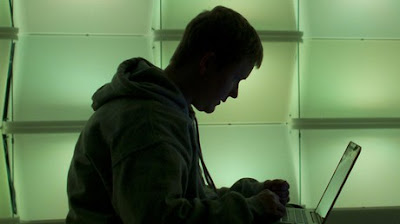

If you are concerned with the internet security and privacy of your computer due to so many threats existing in the world of internet connection, then you would want to find out how to increase these features inside your device. It has been confirmed that at least 1% of PC users contact the malware which is destined to steal financial information from your personal computer.  
  

  
The following steps will help you get an increased internet security to avoid being exposed to these sorts of threats:  
  
\* The first step to take is to make sure that the anti-virus software is installed on the computer. You could access one of these anti-virus software-s for free and download it right on the Internet. Keep in mind that the software needs to be updated, as there will always be a new virus and/or malware that the new anti-virus software will be able to detect and delete.  
  
\* Secondly, have the anti-spyware software installed and update it as well. It is good to know that many of these spyware-s can be detected and deleted from the anti-virus software, but to keep you protected for the future it is good to install one of these anti-spyware software.  
Through the spyware you can become one of the victims of identity theft, therefore internet security experts suggest that it is better to have Spybot Search & Destroy along with other two such software to help you stay safe and secure. They can be also downloaded online for free. Through Windows Vista you are offered the Windows Defender, also included for free inside the program.  
  
\* Install a firewall, if there isn't already one installed, the same that Windows XP and Vista have included for free for their users. Make sure that this one is activated.  
  
\* Internet security and privacy is moreover essential if you have a wireless connection. Make sure to encrypt the Wi-Fi network with the strongest encryption format that your network supports. If not, you will be exposed to anyone within a distance of ten miles to capture your bandwidth and steal it. Your internet connection can be easily used by a hacker and access sites that are illegal or even loaded with potential malicious software.  
  
\* Another way to provide internet security is to keep the modem and router turned off in case you don't operate with your computer for a longer period of time. It is impossible for anyone to violate a computer network if all these devices are disconnected.  
  
\* The last thing to do for benefiting from internet security and privacy is to make sure that the OS is updated and that the latest security patches are already downloaded.  
  
It is quite obvious that no one could guarantee for a 100% internet security and privacy, but at least you can do all your best to get these ways ensured for your computer's well being.  
  

_This is a guest post by Denis. Denis is a contributor for Yourloan.ca where you can get some resources on [personal loans canada](http://www.yourloan.ca/loan-articles/) and also information to find the best  [Canadian Student Loans](http://www.yourloan.ca/student-loans--credit/)._
