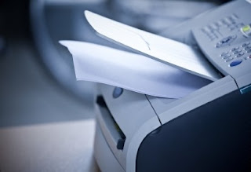

Whether you’re a printer for your home office for the first time or just in need of a replacement, inkjet versus laser is a question that will be on your mind. Which should you choose? What is the best investment? The highest quality? Which is the right choice for you? There is no quick, easy answer to this question. When you’re trying to decide, you need to weigh a few different things concerning what you’ll be using the printer for. Each home business is different, and you’ll need to consider your own personal needs when deciding between an inkjet and laser printer.  
  

  
  
Here are some things you should think about that will help you make the best decision.  
  
**Cost**  
Depending on your budget, the cost may be one of the most important factors when choosing a printer. Traditionally, inkjet printers cost less than laser printers. This information alone may be the deciding factor for you if initial investment is an issue, but don’t act too quickly. If you base your decision on initial price, you may end up paying more down the road. Your printing needs should dictate which kind of printer you purchase. But in the interest of price comparison, consider that inkjet printers may cost most in the long run, because ink is often needs to be replaced more often than toner. Laser printers use only toner, and one cartridge of toner typically lasts longer than ink. However, these estimates aren’t always reliable, because the frequency and type of printing you do is what will be the best indicator of your printer’s overall cost.  
  
**Text and Photos**  
You will first need to think about what you are usually printing in your home office. Are you printing primarily text or photos? Laser printers generally win out if you only have the need to print black-and-white text. Inkjet printers are typically better for color photographs and images. If you will be printing only on traditional printer paper, laser printers are great. If you need to print on a variety of materials, inkjet printers may be a better way for you to go.  
  
**Frequency**  
If you have the need to print lots of pages on a regular basis and quickly, a laser printer may be better for you, because it is generally faster, especially for simple text. The speed of the printer will vary in its quality, though, and many inkjet printers also have the capability to print very quickly. Even on a laser printer, things will go slower for photographs. The estimated pages per minute are not very accurate, especially for color images. If you only print once and a while, an inkjet printer would be just fine.  
  
**Size**  
In general, inkjet printers are smaller and more compact than laser. If your home office is cramped and short on space, you might want to consider a small inkjet. However, laser printers have developed so that they are not as big and bulky as they once were. Laser printers usually have larger paper trays than inkjets. Size will vary greatly depending on the model you want to purchase.  
  
Before printing any large document make sure you verify the [accuracy](http://myblogtips.net/blogging-2/increase-efficiency-productivity-article-writing.html) of your content using a powerful [grammar checker](http://www.grammarly.com/) such as grammarly.  
  
This is a guest post by Ruth Johnson who is a multimedia guru with a degree in journalism and a deep passion for content development.
