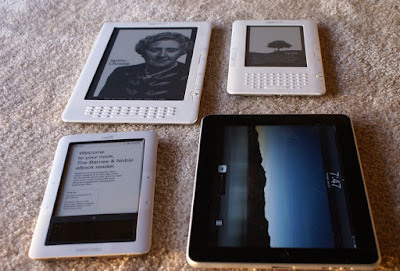

So you finally gave in – you finally decided that it’s time to invest in an e-book reader.  But which one?  Apple’s iPad?  Amazon’s Kindle?  Noble’s Nook?  Choosing an e-reader may seem like an overwhelming task, but with the right information and the awareness of your particular needs, the choice should be a simpler one than you may think.  
  
  

  
  
**Reader or tablet**  
Are you looking for just a book reader, or do you want access to magazines and newspapers as well?  Do you want a device that allows you to browse the Internet, listen to music, and watch movies, or do you have your laptop for all of that?  
  
If all you’re looking for is a device on which to read books, and maybe newspapers and magazines, in black and white, a simple e-ink reader is your best – and cheapest – bet.  The $79 Amazon Kindle, not touch screen, is the least expensive, most basic option available.  You could also look into the Kindle Touch or Nook Simple Touch.  
  
For more versatility and color, you’ll want a tablet.  High end tablets, like the iPad, are functional and pretty, but also pricy – around $500. 
  
Smaller tablets, however, have found a happy medium between the e-ink readers and large tablets.  These devices, such as the Nook tablet and Kindle Fire, feature 7-inch color LCD screens, and a number of media, entertainment and productivity apps.  
  
**Size matters**  
Anything with a touch screen is going to be larger and slightly heavier than e-ink readers.  When considering screen size, keep in mind that all e-readers allow you to adjust the font size, so a smaller screen does not necessarily affect its readability.  If you want to read magazines, newspapers or PDFs, however, remember that smaller screens have a tendency to make them look more cramped.  
  
**Wireless data**  
When it comes to Internet, you have two options: Wi-Fi and 3G.  For just reading, Wi-Fi may be sufficient.  You can download as many books from the Internet as you want, and then switch the wireless off while you read to lengthen battery life. [iPad downloads](http://www.ipaddownloadreviews.com/) are renowned as being a bit better than the others'.  
  
If you want to use this device for access to email, apps, the Web, etc., the 3G models are more practical, especially if you travel and need constant, reliable Internet everywhere.  
  
The Nook, Tablet and Kindle Fire are only available with Wi-Fi, and he Kindle Touch offers two different 3G options.  
  
Once you take all of these factors into consideration, pick out the device that is most suitable for you and your needs, download some books, and get to reading!  
  

Hannah Kalstrom is an avid reader who enjoys both the paper and electronic forms; and has experience using all of the above devices. She writes many iPad download reviews such as one [DownloadiPadMovies review](http://www.ipaddownloadreviews.com/ipad-movie-sites/downloadipadmovies-review/).  
\[[Image Credit](http://rdeeds.wordpress.com/2010/04/06/nookkindle-vs-ipad-as-ereader/)\]
