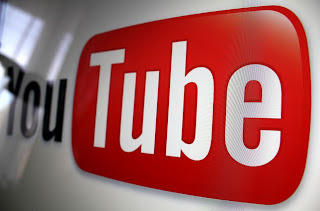

YouTube to mp3 websites are wonderful tools for anyone who enjoys listening to their music on YouTube and want it in mp3 format. In the digital age, it is certainly not unusual for people to see a video on YouTube that features great music they would love to have in their own personal collection. However, you cannot simply download a video and automatically get it in mp3 format. This is where conversion websites that provide a service comes handy.  
  
  

  
  
The YouTube to mp3 conversion tool is highly useful and extremely convenient. Simply go to google and type in "YouTube to mp3" and you are presented with a number of sites that provide this service for free. There is no need to download any software to your computer, which is great because the fact is, you never know what you might get -- malware included. The conversion tool is simple to use and is in fact a website that anyone with Internet access can venture to. All that is needed is a URL from YouTube, and you will be all set. Find a great video featuring a song you have been wishing to download, copy the link and then paste it into the field provided on the site. From there, all you would need to do is to click on the large button below to begin the download process. The website prides itself in being the most reliable and convenient conversion tool for music from YouTube to be made into mp3 format.  
  
**Free is Best**  
One of the best aspects of the [YouTube to mp3 converter](http://www.youtube-to-mp3.com.au/) is that it is 100 percent free. There is also no limit on how many downloads you can perform, so you will no doubt find yourself venturing back to the website time and time again. This is a great way to get your favorite music in mp3 format without having to spend loads of money! The website urges all of its users to spread the word about the great service to as many people as possible so that they too can experience the convenience of downloading their favorite tunes.  
  
Depending on your Internet connection, the actual conversion and download process can take anywhere from a mere minute or as much as five minutes. In general, most people will see results within two to three minutes due to the fact that most online users rely on a cable or DSL Internet connection. Of course, if you are a bit behind in the times and use dial-up, the download will take a somewhat longer amount of time.  
  

This is a guest post by Shon Siemonek. Shon is the owner of Luscious Media Technology blog.
