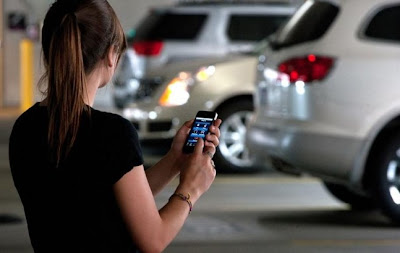

  
If you have an iPhone or an Android device, you’ve got apps. Games, organizers, calendars and various trackers can be found on virtually any mobile device. But do you have apps for your car? There are tons of apps for drivers; some are free and some will cost you but they are all useful.  
  
  

  
  
Here are our favorites:  
  
**G-Park**  
  
While it can be difficult to lose your car in the parking lot of an amusement park with their lot markers and landmarks, it is incredibly easy to misplace your car at the mall. If you frequently find yourself wandering through parking lot aisles searching fruitlessly for your car, this app is for you. When you exit your car, hit the ‘Park’ button and when you’re ready to find it, hit the ‘Where did I park?’ button. The app will guide you to your parking spot. Handy!  
  
**Pocket Parking Meter**  
  
Try to find someone who hasn’t been dinged by the parking police and you’ll be searching for quite a while. It’s easy to lose track of the time left on your meter, especially if you get caught up in something important. With the Pocket Parking Meter you have a virtual countdown until your meter expires and an alarm to let you know when you’re close. You may never pay a fine again!  
  
**Trapster**  
  
You’re humming down the road at a nice clip, going with the flow of traffic when out of nowhere flashing lights are blazing in your rearview mirror. Where on earth did that cop come from and why did he pick you? Keep Trapster open to be notified of speed traps in your area. Notifications give you plenty of time to slow down to a reasonable speed and watch that other guy get pulled over this time.  
  
**Google Maps**  
  
If you’ve got an iPhone, Google Maps came preinstalled. Log in and see how easy it is to use! A GPS and car locator all in one, the app can help you navigate unknown streets from Paris to New York. The best feature? You will never have to pay to update your maps like you do with your Garmin or Tom Tom. Google Maps is automatically updated for you at no cost.  
  
**MapQuest** is one more app in the navigation category which is voice-guided, turn-by-turn, GPS for iPhone. Your phone speaks to you, telling you when to make a turn in which Google Maps lags. The blog owner personally recommends this app over native Google Maps.  
  
**Gas Buddy**  
  
Gas Buddy will tell you where to find the cheapest gas no matter what city you’re in. Updated by users of the app, prices listed are always the most recently reported giving you real-time information. Download the app and return the favor! Next time you pass a gas station be sure to upload the current price per gallon.  
  
**Shazam**  
  
Nothing is worse than driving down the road, singing along with the radio at the top of your lungs and waiting for the DJ to announce the name of the song, only to have them segue into a commercial instead. What was that song? Who was singing? This will never happen to you again with the Shazam app. As long as the song has been uploaded to its vast database, Shazam can tell you the title of the song and its artist with the tap of a button.  
  
We have become dependent on our apps and for good reason: they’re incredibly useful! If you’ve got a car and a mobile device, you need these apps. You’ll soon wonder how you functioned without them. We have recently also [seen some wonders](http://www.cosmogeek.info/2011/11/siri-hacker-siri-can-start-stop-lock.html) using iPhone 4S's Siri hacks which can control your car.  
  

This is a guest post from Stephen Anderson. Stephen is an insurance consultant who recommends that you search online for [Car Insurance Comparison Quotes](http://www.carinsurancequotescomparison.com/Car-Insurance-Specials.php) to make certain you get the best available deal. [Allstate Auto Insurance Discounts](http://www.carinsurancequotescomparison.com/Allstate-Insurance-Company-Discount-Programs.php) are just one example of the provider specials available for comparison.
