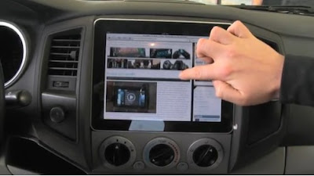

iPad’s can be fitted anywhere, or maybe we are forcing the issue when it comes to cars. Internet users are so addicted to accessing the internet, or playing with applications that they want the presence of the iPad even in their cars.  
  
  

  
  
**Mounting an iPad** on your car seat is not difficult as long as you are dedicated to the task at hand.  Some companies have performed the work for you with installing Apple tables on seats of new cars along with a hefty price tag.  Some car manufacturers are doing this with some of their newer models. The Mercedes-Benz S550 and the Hyundai Equus are luring in internet savvy car-buyers with such technology. These car manufacturers will install the technology for a nominal fee because who has the time to accomplish this task?  
  
When you think about it, having an iPad in your car proves useful, especially when you are traveling with children of any age.  This product can save you hours of continuous complaints, arguments and let us not forget the age-old question of “Are we there yet?” being asked repeatedly. The Apple tablet being installed in your car is a superb upgrade with the flat-screen of the product making it easy to fit to the inside of your car.  The product proves a God-send for kids to watch music videos or movies.  This allows you to concentrate on the road so that you can deliver your family safely to your destination. Having an iPad in your car can also provide useful features such as **GPS** which allows for map navigation, to help find locations without holding huge, bulky devices.  
  
There are tons of critics who are skeptical about such technologies in cars.  Some will complain about battery usage, which proves a legitimate complaint considering you cannot currently charge an iPad in a car.  The product is not compatible with other devices and uses a 10W AC adapter. Where this proves a legitimate concern, the ability to watch movies and music videos for your children while traveling, even if only for one day, makes this product worth considering installing into your car.  
  
There are safety concerns about this device being in a car because of viewability while driving. There are iPad applications that are available that make viewing the iPad while on the road safer. Installing an Apple tablet in your car can bring the convenience of home entertainment and many car owners appreciate this technology.  
  
There is fierce competition in the tablet industry.  Car owners who desire this type of technology should conduct their research carefully.  It is not about obtaining the most expensive technology with all the frills and whistles; it is about bringing technology to life in your car while allowing you to travel to destinations safely.    
  
_This is a guest article and is written by Michael Clark. Michael has curious mind and is every ready to learn new things. Visit his site for [bijtelling berekenen](http://www.volkswagen.nl/home/over_volkswagen/wat_kost_autorijden/bijtelling/0,19155,_D0Lnl,00.html) and [Auto leasen](http://www.volkswagen.nl/home/over_volkswagen/volkswagen_zakelijk/leasen/0,20735,_D0Lnl,00.html)._
