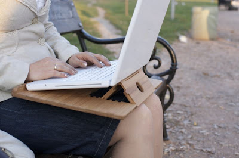

Your laptop’s just as good as how much battery power you have left, especially if you use it unplugged a lot. There is, of course, the option of leaving your laptop plugged in most of the time, but mobility - the main reason to get a laptop - does require you to be unplugged from time to time. And during these periods, you certainly will want to extend the life of your battery for as long as possible. The good news is that there are many practical things that you can do to make the most of whatever power you have in your laptop battery. Apply these tips and enjoy your laptop for a longer time without having to scramble around looking for a socket.  
  

  

## Turn Wi-Fi and Bluetooth off when you do not need them.

You may always want to be connected, and the chances are that in most places you go, you will have Wi-Fi access. However, this does not mean that you actually need to connect, and if battery life is an issue, turning off the Wi-Fi will definitely give you longer battery life. The same applies to Bluetooth, which is even more rarely used than Wi-Fi. Truth be told, by default, my laptop’s Bluetooth is turned off.  

## Adjust the screen’s brightness level.

You may like your screen to be as bright as possible, but that is not really going to help your laptop’s battery life. More so, screens that have settings that are too bright will only hurt your eyes in the long run. The smart thing to do would be to lower the screen’s brightness level as much as you can without putting any strain on your eyes.  

## Only run programs that you will need.

If you are on battery saving mode, you really have to make some sacrifices. You may be the kind of person who has 20 tabs open at the same time. You may have the need to run several programs at the same time. However, if you really want to extend your laptop’s battery life, you will have to limit the things that you do on it.  

## Don’t use any peripheral devices.

I know that there are people who prefer to use the mouse even though there is a trackpad on their laptop. There is nothing wrong with this, but the mouse does add strain on the battery. If you can, avoid using your mouse if you need to extend your battery life. That being said, using an external optical drive, USB drives, and other similar devices is not a good idea if you want to get more out of your laptop’s battery.  

## Turn the volume off.

Depending on what you will be using your laptop for, turn the volume down or turn it off. Obviously, when the speakers produce sound, the laptop will use more battery power. If you can do without the sound, you will be able to conserve more power.  
  

_This is a guest article. Can’t get enough of anything shiny and related to tech; will also pay attention to non-shiny things as long as they have something to do with computers and gadgets. If you want to be as prolific as Gregory, consider looking at [a blog directory](http://www.blogger.com/%E2%80%9Dhttp:/www.blogsearchengine.com/submit-blog/%E2%80%9D) such as Blogsearchengine.com and enjoy the incoming traffic!_
