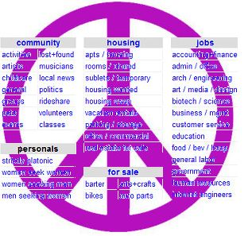

If you’re looking to make some extra cash, you might want to try turning your efforts toward Craigslist’s local and free online classified ads. [Craigslist](http://craigslist.org/) has been around for a while, but it’s still a place that many people frequent. It’s a great place to meet people in your community for group activities or mutual interests, find or post a job, and buy or sell just about anything at all. If you use it correctly, you can find some great opportunities to earn some extra spending money. Start by signing up for a free account and finding your local page. There are Craigslist sites for hundreds of cities and regions across the country, so find the one or two closest to your location and get started.  
  

  
  
**Wanted**  
One of the easiest ways to earn some extra money on Craigslist is to browse the Wanted section. Here people place all kinds of advertisements of things they’re looking for. Lots of time people are looking for donations or items of little value, but there are also lots of people with cash to burn. Oftentimes collectors will post ads looking for specific items such as WWII memorabilia or antique toys. There will also be people searching for a good price on certain electronics they want, such as a TV or iPhone. Other people are looking for tools, equipment, cars, video games, concert tickets, and much more. Peruse these listings, and you may find someone who wants to purchase something you’ve got, even if you never considered before that someone might want it.  
  
**Gigs and Services**  
The Gigs and Services sections are also helpful. To start, browse Gigs for anything that you might be able to do. While you’ll probably have to weed through some gigs like adult film casting calls, there are often many other legitimate opportunities. Lots of times people list odd jobs or one-time gigs, such as people who need help moving one piece of furniture or help moving into a new house. If you have a truck, people often post looking for help hauling things. There may be many other opportunities, like people looking for skilled contractors, writers to edit a resume, cleaners to clean or organize a home, babysitters, and much more. In the Services section, you can post an ad offering your services for whatever it is you can do best, such as being a DJ, raking leaves, catering, or anything at all. You never know when someone will be looking for a local person like you.  
  
**For Sale**  
If you have anything at all that you’d like to sell, Craigslist has a category for you to post in. You can sell electronics, clothing, cars, books, furniture, materials, crafts, and so much more. If there isn’t a category for you, just list to miscellaneous. The good thing about selling on Craigslist is that it works. Lots of people browse the For Sale ads on Craigslist before they go to the store when they’re looking for something in particular. If you offer your items for a reasonable or low price, you’ll likely find a buyer in no time. Your ad will be even more appealing if you include a photograph. Once someone replies, you can meet up the very next day and exchange for cash. Just remember to always use caution when meeting up with people you’ve found on the Internet.  
  
_This is a guest post by Carrie Waggoner. She is an avid bargain hunter and Craigslist User. She funds her habit with Freelance Writing work and [social media management](http://befoundonline.com/about/social-media-marketing). For excellence in her work and always uses a [grammar checker](http://www.grammarly.com/)._
