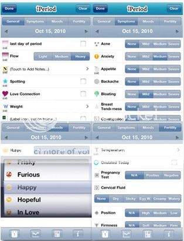
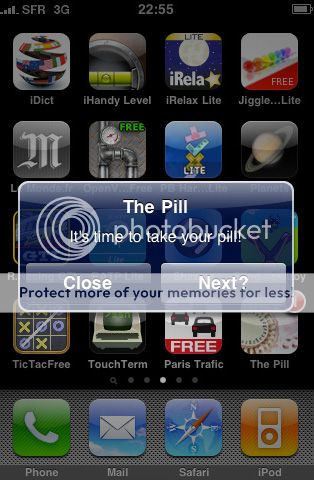

Everyone has heard about how great **iPhones** are. They have apps, or applications, for just about anything you could need, they can communicate over wi-fi, and they can have as much memory and processing power as a laptop.

Business executives use them to keep track of companies and teenagers use them to text and surf the Internet. While iphones have uses for almost everyone, there are certain features which make them especially useful for women.

## Useful Apps for Women

Apps are one of the biggest attractions for iphones. Apps allow individuals to customize their iphones to do the things that interest them, from gaming to calculating. Many of these apps can be very useful for women.

**The iPeriod Ultimate app**

****

The iPeriod Ultimate app can help keep track of your periods, fertility, and ovulation to help you stay on top of your cycles. Many women have made a lot of use out of this app.

**Pocket First Aid**

Pocket First Aid is another app that can be very helpful. This app gives first aid instructions for many problems such as choking and accidental poisoning. This is a helpful app that most people could find handy, but it can especially be helpful for mothers since children have a tendency to try everything.

**The Pill**

****

Another app that many women have made use of is The Pill. The Pill is an app designed to keep track of a woman's birth control pills. It can be very handy, especially if you are the type who has trouble remembering whether or not you have taken your pill yet.

**Woman's Calendar** Woman's Calendar is another useful app specifically for women. It keeps track of fertility cycles to help a woman either become, or avoid, becoming pregnant. It can also help keep track of other health information so it can work as a sort of medical calendar.

**GroceryIQ** 

GroceryIQ is a helpful app for iphones that allows an individual to make and organize his or her grocery list. This is helpful for people who often go to the store and then spend a long time trying to remember "What do I need?" It also helps users find coupons for groceries.

iphones are very useful tools and very fun toys. And, while they are becoming more useful for video gamers, sports fans, and business gurus, they are also becoming more useful for the average stay-at-home mom and the average business lady.

_This is a guest post by Jessy. She is a housewife, mompreneur and finance blogger for Life Insurance Finder, the free app to compare life insurance types and providers._
