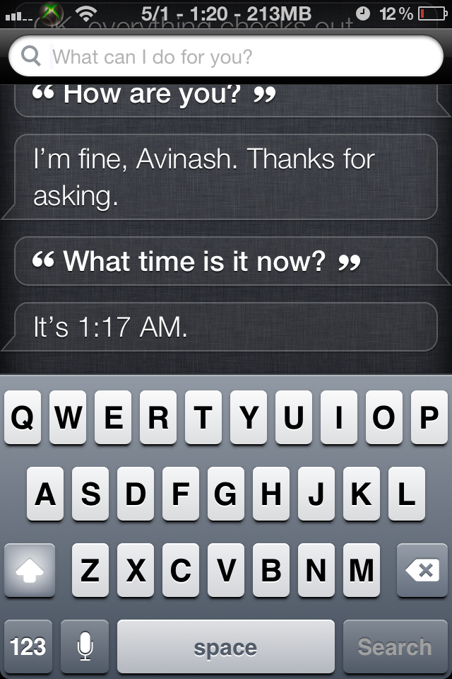
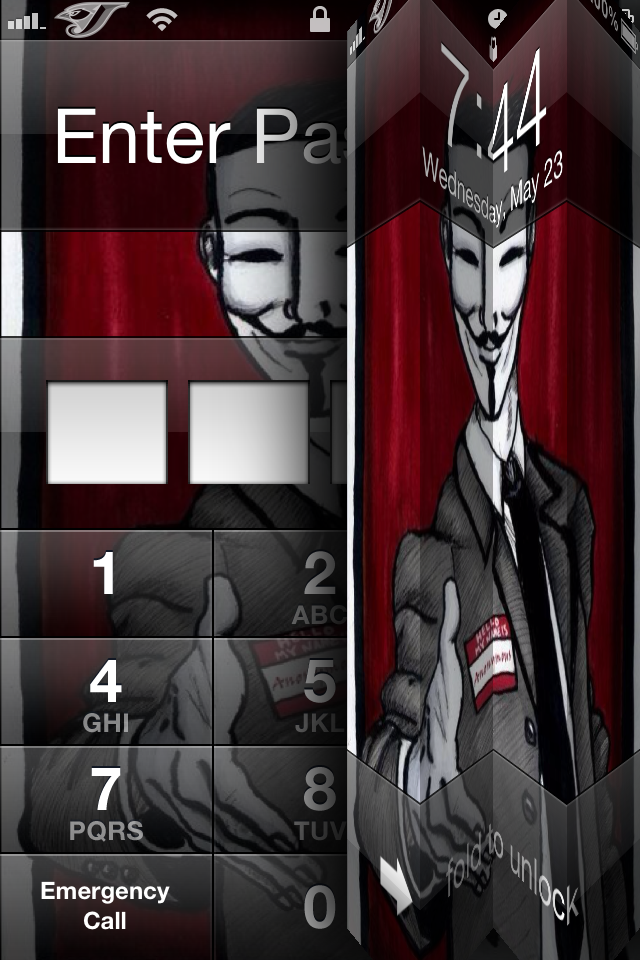

For the past four months, I've used a [stock iPhone 4S](http://www.cosmogeek.info/2011/10/iphone-4s-unboxing-pictures.html). That was not my choice as there wasn't a jailbreak for iPhone 4S. Today, I've jailbroken my iPhone 4S to experience the magic of Cydia!

You are probably thinking – why should you consider jailbreaking your device? Some simple reasons are mentioned [here](http://www.cosmogeek.info/2010/09/6-simple-reasons-to-jailbreak-your.html) despite many.

First day screenshots from my new device -

 

**The Notification Center -** Notice the ‘Superman’ logo replacing the official carrier logo. Date, Time, free memory in the status bar. Instant call, One touch twitter, search google, spy cam, and more – all from the notification center

 

 

**Home Screen –** Look at the dancing Cydia icon on the dock screen. And count the number of icons on the dock!

 

**Siri –** This one is a baby out of many available tweaks from the big repository. You can tweet, open programs and more right from Siri.

 

**Lock Screen –** One more color tweak

 

**Custom** [**cosmoGeek**](http://cosmogeek.info/) **Carrier Logo! (This is really awesome) \[Updated: Feb 21, 2012\]**

 

 

Some other popular tweaks you can consider installing from Cydia are Zephyr (multitasking gestures), BiteSMS, SBSettings, Safari UniBar, MxTube, ProTube, etc.

**SiriStatus - How to know what Siri is doing or type a command? \[Updated: May 1, 2012\]**

Today, I came across an awesome Siri tweak from which you can know what Siri is doing exactly while you pass a voice command. You can also send commands by typing from a virtual keypad.

**SiriStatus** - a jailbreak Cydia app, developed by a [17 year old Indian kid](https://twitter.com/#!/rv1raj),  does all the magic. It adds a small banner to Siri's UI and will display 6 messages (Idle, Thinking, Listening, Processing, Failed, Try Again Button) in total depending on the status of what its doing. Another great feature of this app is the search bar from which you can type a command to Siri via a keypad. You can download this app from the Cydia Store for free.

 

**Beautiful Fold To Unlock Tweak \[Updated: May 24, 2012\]**

This amazing fold to unlock concept which I discussed [last time](https://twitter.com/k_avinash/status/202893945171222528) is now a reality. It was born out of Anton Kudin’s [concept](http://dribbble.com/shots/561102-fold-to-unlock-ios-style) for the iPhone which immediately captured attention of the jailbreak community. As in the name, Unfold which was developed by a German developer [Jonas Gessner](https://twitter.com/#!/_maxner_) replaces the default slide to unlock behavior on your home screen with a pretty fold up animation. Grab this copy for free from Cydia. This app currently do not support iPad yet.

 

Come back to this page for more screenshots and tweaks. I am always on the top of the new jailbreak apps and tweaks. Meantime, let us know which of these you would recommend and any other interesting in the comment section below.
