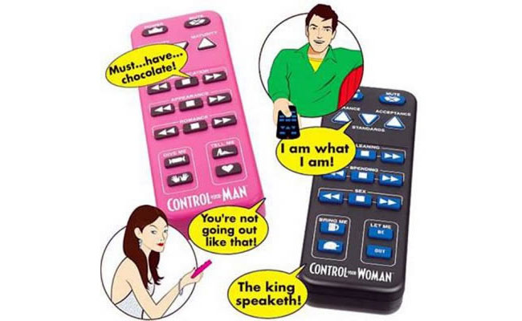
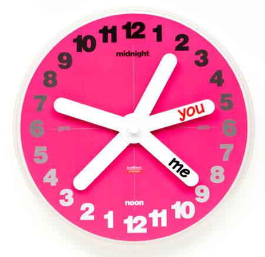

If you have a geeky boyfriend or girlfriend and you really find it tough to impress him/her with the conventional roses, chocolates and teddies, then try something wacky that will get them noticing you and the gift in no time!

Here are some weird gadgets that your beau is sure to adore this Valentines:

  
**1\. The 'Control Your Spouse' talking remote**  
This talking remote will surely have your man or woman cracking up with the verbal one-off sounds and effects that will put your spouse back on track! Now the famous one-liners can be belted out with the help of a button mimicking the popular "What were you thinking?", "What about my needs?" or the "All right, hand over the credit cards!" and many more! You could buy this talking remote in either male or female varieties - which will make your love, think of you all the time!

  

**2\. The Human Key Kinky Holder**  
These cute and geeky key holders shaped like a ‘male’ or a ‘female’ will ensure that your spouse never leaves without his or her keys. This wall mountable kinky key holder is probably the perfect gift if your partner is the forgetting types! This one is a very handy Valentines present, that will ensure that your better half never ends up with missing keys with this geeky gadget!

  
**3\. "My Beating Heart" Pillow**  
This cute geeky pillow reproduces heartbeat whenever you hug it and it actually tries to create a unique heartbeat each time! It actually records your heartbeat and can modify it in many different ways. This is a cute and geeky way to make your lover feel that your heart beats for him or her!

  
**4\. The You and Me Personalized Wall Clock**  
This cute clock has multiple hands and you can just write each other’s names on each of the hands and share the hours together with this cute wall clock! This is the perfect gift if you want to make him or her understand that time will never come in between love!

  
**5\. The Ring Cup**  
This Ring Cup will serve as a reminder to your geeky companion about what you have in mind this valentines, as the handle of the cup is shaped like a diamond ring! This is an excellent reminder of what plans you have ahead with the Ring Cup!

  
**6\. The 8-Bit Dynamic Life Shirt**  
The concept of this shirt is to buy it in a pair as you have to wear one along with your partner, as these shirts measure the proximity of two lovers. Whenever the two of you fall within the range, then the pixilated hearts start to glow completely and when you are not in range, then only 2 1/2 hearts glow!

  
**7\. The cute USB Tulip Hub**  
Roses are conventional and passé, but if your beau likes all things geeky, then go right ahead and gift him those amazing USB tulips that are the coolest flowers ever! Your lover is sure to adore this valentine gift which is compatible with both Mac and Windows systems.

  
Try to go a little geeky and unconventional this valentines and gift your beloved a gadget that is whacky and cool! Happy Valentine’s day.

_**About the author:** Alyssa Clarke is a blogger who is all into gadgets and expensive stuff. She recently bought a cool [glass TV stand](http://www.hometone.com/entry/top-10-glass-tv-stands/) and wireless headphones. She is big fan of [Gucci Watches](http://www.styleguru.com/entry/top-10-gucci-watches-women/) and is soon planning to buy a new one._
