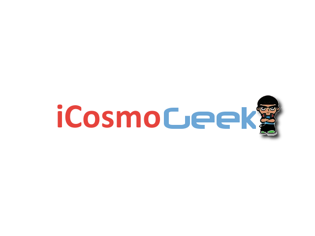

 

Today is a big day for this blog! After blogging for over 2 years under the domain name www.cosmoGeek.info, I have decided to make a strategic move and change the domain name to **www.iCosmoGeek.com**.

When I started blogging 2 years ago, I had no idea it would get this big. Today is very emotional day for me. I feel like I'm seeing this blog future ahead. I have all those good memories running in my mind. I am excited and I am incredibly proud of what I have accomplished out of this blog as of now. But there is lot more to do.

While thinking of the domain name change, there is lot of hard work need to be done for the smooth migration. I am confident of the IT knowledge and research skills I have to make this achivement. I am also confident on the user interface and experience of this new blog interface. The main concern is you, **iCosmoGeek reader**.

 **What is the main reason for this major release?**

In fact, this release include two major changes. First one is the domain change name from cosmoGeek.info to iCosmoGeek.com. And the second one is a change in the blogging platform.

When I started blogging, I had no idea of the power of it. At that time, I've chosen 'the famous' Blogger as a blogging platform and less popular .info domain name.

Throughout this blogging journey, I've learnt lot of things from fellow bloggers and especially the power of WordPress.org. Eventually, I've decided to design this blog on a self hosted WordPress.org (NOT WordPress.com) on a dedicated hosting space. With self hosted WordPress.org software, I now have the abiltiy to upload custom themes, plugins and comple control to change the code. Credit goes to Genesis Framework for easy customization and HostGator for providing space. I hope both these services impress me.

To be honest, the domain name change from less popular .info to most popular .com is to reach broader audience. With that in my mind, I've decided to change it to www.iCosmoGeek.com. Some of you can ask - why not cosmoGeek.com instead of iCosmoGeek.com? Well, the original domain owner of cosmoGeek.com is expecting a four digit figure for the domain transfer. Huh! I humbly told him that I am only running this blog out of my passion towards technology and declined it. I coined a new name with a prefix 'i' to the original name (of couse, inspired from the legendry Steve Jobs!). If you type the old domain name now, Google may throw 404 error. The 301 redirection to the new domain name might take few hours from now.

I know some of you will be pissed after reading all this _yada yada_ thing. To keep things smooth, I will answer that if you've been enjoying reading the current blog for the past few months, then you will love the new **iCosmoGeek.com** too. Not much will change really in terms of niche. I'll still keep a major focus on the technology related happenings along with my research activities.

Please let me know about this change in the comments section below and I know many of you will welcome it. Right now, besides the new domain name and blogging platform, I've redesigned the logo as well. For the next few days, the blog will be in beta stage and eventually make changes on the feedback. I know its not going to happen overnight and please bear with me while I make the transition. If you see something is broken, please let me know via the [contact page](http://icosmogeek.com/contact). And haters are always more vocal than lovers and I'd love to get feedback from them as well. I do have egos that need to be boosted!

**Thank you again** and I am able to do what I love towards my passion. Here's to the future!
