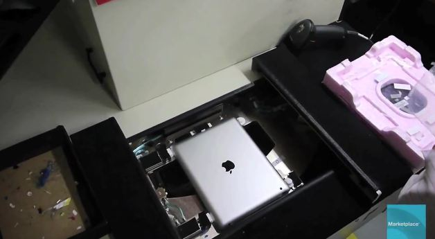

 

Maketplace's Shanghai Chief Rob Schmitz found his way into the factories of Apple's Chinese producer, Foxconn. Rob recently granted an extremely rare opportunity to visit the factory floor and he is only the second reporter to be allowed till date.

Foxconn is the largest manufacturer of electronics an computer components in the world. Foxconn produces several common consumer electronics including the Mac mini, the iPod, iPad, and iPhone, Dell, HP, Playstation 2 and 3, Wii, Xbox, Motorola, Nokia, and the Amazon Kindle.

 

 

It is interesting to look at how machines streamline some of the process. Schmitz also noted a few other interesting points, such as workers switching positions every few days while making $14 a day when first starting. Its actually pretty interesting to see how that innovative piece of thing is made. What do you think of this video?

 

<iframe src="http://www.youtube.com/embed/5cL60TYY8oQ" frameborder="0" width="560" height="315"></iframe>

\[[Read More](http://www.marketplace.org/topics/tech/apple-economy/video-watch-ipad-get-made-foxconn-factory-floor "Marketplace")\]
