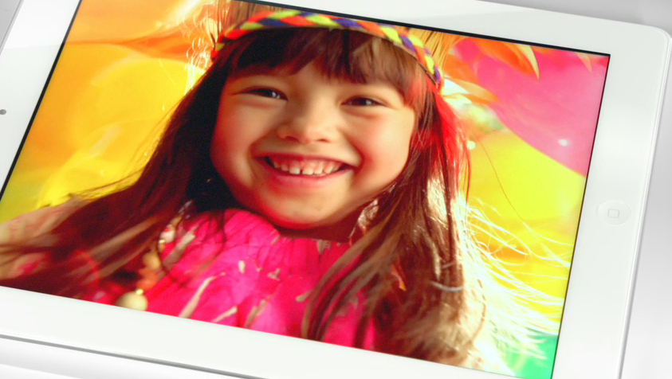

 

In an official press release statement today, Apple confirmed that it is going to launch the [new iPad](http://iCosmoGeek.com/2012/03/why-apple-actually-named-the-new-ipad-as-the-new-ipad.html "Why Apple Actually Named The new iPad as ‘The new iPad’") in India on April 27, 2012 with price starting from Rs. 30,500.  Additionally, Apple will be rolling out this third generation iPad to twelve additional countries including South Korea.

The new iPad features a stunning new Retina display, new A5X chip with quad-core graphics and a 5 megapixel camera with advanced optics for capturing amazing photos and 1080p HD video.

The [press release](http://www.apple.com/pr/library/2012/04/16New-iPad-Arrives-in-South-Korea-11-Additional-Countries-This-Week.html) also notes that “_4G LTE is supported only on AT&T and Verizon networks in the U.S. and on Bell, Rogers and Telus networks in Canada”._

This means the new iPad won't work with recently launched Indian 4G networks. On the other hand, 3G still works and the prices seems to be comparatively fine when compared to the second generation model.

Price range in India -

> **WiFi Only Model -** 16 GB for Rs. 30,500; 32 GB for Rs. 36,500; 64 GB for Rs. 42,500
> 
> **WiFi + 3G Model -** 16 GB for Rs. 38,900; 32 GB for Rs. 44,900; 64 GB for Rs. 50,900

Apple kept the same price as that of iPad 2 used to be in retail market. With this new iPad release, iPad 2 had also got a price cut and now starts from Rs. 24,500.

Will you be tempted to buy this amazing product for the current price?
