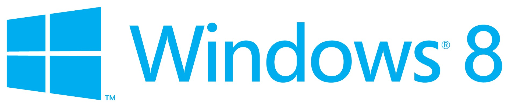

Microsoft has just announced the final Windows 8 editions that are going to be released in the consumer market. In the official announcement on Windows Team Blog, Microsoft again confirmed that **Windows 8** is the official name of this next generation release.

In contrast to number of editions available in the previous editions of Windows (even in Windows 7, we have around six editions available in the consumer market), Windows 8 will now be available in only **three** editions - Windows 8, Windows 8 Pro and Windows RT.

Simplifying into only 3 editions is a big and good move. For PCs and tablets powered by x86 processors (both 32 and 64 bit), there will be two editions - **Windows 8** and **Windows 8 Pro.** 

Windows 8 include all the features and is similar to previously only available in Enterprise/Ultimate editions of Windows. Windows 8 Pro is designed to help tech enthusiasts and business/technical professionals offering encryption, virtualization, PC management, etc.

**Windows RT (Run Time)** is the newest member of the Windows family also known as Windows on ARM or WOA. This edition will only be available pre-installed on ARM PCs and tablets, and will include – for free – touch-optimized versions of Office 15 applications Word, Excel, PowerPoint and OneNote.

Finally, Windows 8 Enterprise is one more edition which will include all the features of Windows 8 Pro and is only available to customers with Software Assurance agreements with the company. And there is one more special local language only edition targeted towards China and a small set of emerging markets.

\[[Read more for the comparison chart](http://windowsteamblog.com/windows/b/bloggingwindows/archive/2012/04/16/announcing-the-windows-8-editions.aspx)\]
