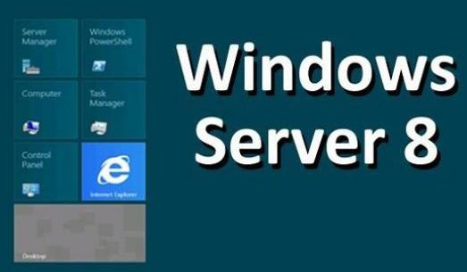

 

Microsoft just announced that the official product name for its next server operating system as **Windows Server 2012.** This is the next release after Windows Server 2008 R2 in the server family which is based on Windows Server 8 code name. The new server operating system is expected to be released later this year sometime along with Windows 8.

The beta release of Windows Server 8 is already available for users to evaluate from the official [website](http://www.microsoft.com/en-us/server-cloud/windows-server/v8-default.aspx). Windows Server 2012 is expected to have new online backup service for its customers based on Azure cloud platform.

In the press [release](http://www.microsoft.com/en-us/news/Press/2012/Apr12/04-17MMSDay1PR.aspx) from Microsoft, the company spokesman also announced **Microsoft System Center 2012** which will be out of beta. More information about System Center 2012 and Microsoft private cloud is available [here](http://www.microsoft.com/en-us/server-cloud/new.aspx).
