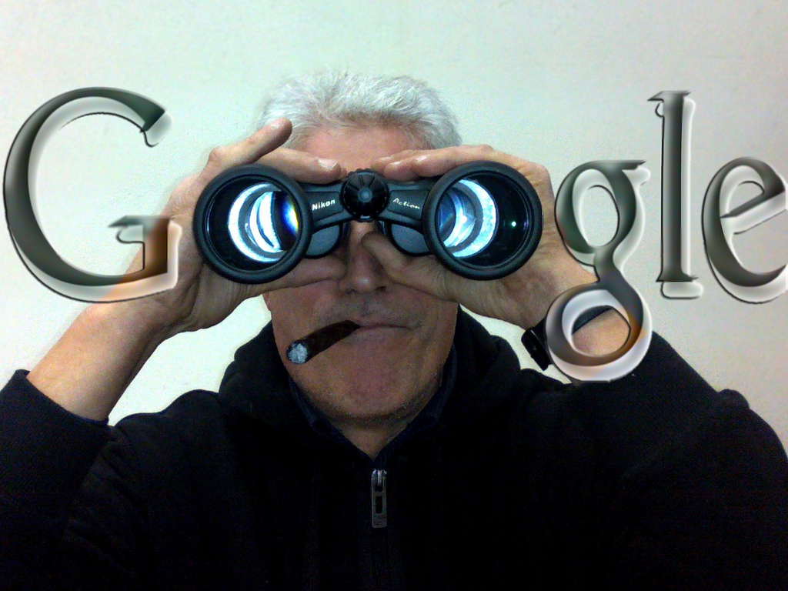

Your day begins with a wakeup call from your Android phone, Google News, then Gmail, Calendar for appointments, Maps for direction to reach your destination. You use Transaltor if you find something interesting that is not in your native language. You use Docs for creating spreadsheets at work, use Google Groups for discussions and spend on Google search rest of the day!

Google has become part of our life. Its an interesting question everyone should consider to ask how much of your life does Google own? Popular services like Gmail, Gtalk, Reader, YouTube, Maps, Calendar, Contacts and of course Search shows everything Google 'owns' your life!

\[[Credit](http://www.flickr.com/photos/cristian_balan/6863438255/sizes/l/in/photostream/)\]

'Don't be evil' is the informal motto of Google. Since the company's incorporation in 1998, Google has come a long way. The question is - Can we still trust Google? Check out this interesting info-graphic from Backgroundcheck.org on Google.

Your thoughts? Do you trust Google? How Google runs your daily life? Share your thoughts in the comments section.

Source: Online Background Check Guide
