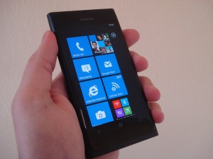

 

This is a great success story of a four group of people (?) formed as **FourBros Studio LLC** who developed a free Windows Phone 7 game - **Taptitude**. The company launched Taptitude in March 2011 with simple minigames and have been updating every week with new games and features. As of today, the company has generated over $100,000 of revenue on this game with more than 300,000 users.

According to the recent post on the company's website, the spokesman said the they have seen a big spike since the launch of Nokia's Windows Phones especially after Lumia 800.

\[[Image](http://www.flickr.com/photos/johnkarakatsanis/6752102893/lightbox/)\]

Taptitude consists of bunch of mini-games and  as you gain points, you unlock more games. The team is adding more games and as of now, the app contains around 60 games. They are using Microsoft's pubCenter and AdDuplex to display ads and kept the available for free in the Marketplace. Recently, they are making around $1400 a day on this game. This is indeed a good sign for Microsoft's new mobile platform which is struggling to gain market share since its launch a year ago. Microsoft made several attempts and campaigns to make developers build apps and games for its Windows Phone.

Follow this [link](http://fourbrosstudio.com/taptitude/post/2012/04/17/Taptitude-a-Windows-Phone-Success-Story.aspx) for  more revenue details and their success story.

Interesting? Are you one of those developers who are willing to make apps for Windows Phone? Or just stick with Apple's iOS or Google's Android?
