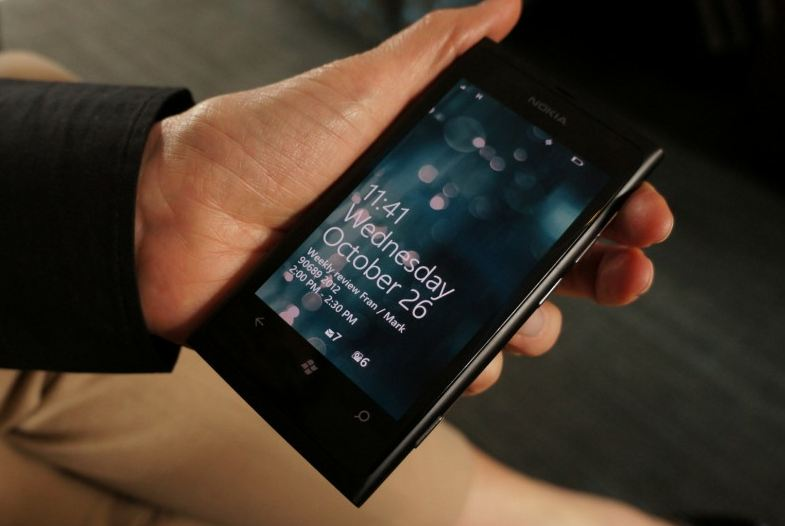

 

The long awaited video calling app, Skype for Windows Phone is now available on the Marketplace as version 1.0.  This official app was first released two months ago in February as a Beta version. The app now graduates to v 1.0. There is no real good working video calling app for Windows Phone users till now apart from Tango. Now that, Microsoft [bought](http://icosmogeek.com/confirmed-microsoft-bought-skype-for-8-5-billion/) Skype last year, the app seems to be a late runner in the Marketplace world.

Skype which works on the peer to peer technology has been doing well in the market for some time. To don’t know what is Skype, it allows users to make voice calls and chats over the Internet. Calls to other users within the Skype service are free, while calls to both traditional landline telephones and mobile phones can be made for a fee using a debit-based user account system.

Even though I have not tested this official app on Windows Phone device, some comments from readers shows that the app still lacks the background capability of calling - meaning that everytime the app should be actually running for incoming calls to be received. We may expect these features in upcoming releases. Let us know about the features of the app in the comments section below if you tried it already on your Windows Phone device.

Download from [Marketplace](http://www.windowsphone.com/en-US/apps/c3f8e570-68b3-4d6a-bdbb-c0a3f4360a51?wa=wsignin1.0).
