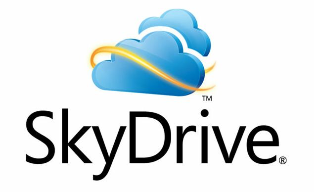
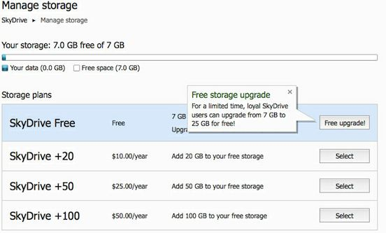

 

This is an excellent takeaway from the updated version of Microsoft's SkyDrive for a limited period of time and available exclusive to its loyalty customers. SkyDrive is Microsoft’s cloud storage service. The service itself has been available for a long time, but Microsoft is doubling-down on the service with features and enhancements designed around the upcoming Windows 8 operating system.

Whether you really use all of the 25GB space or not, act now before it expires!

 

 

From Microsoft MSDN [blog](http://blogs.msdn.com/b/b8/archive/2012/04/23/the-next-chapter-for-skydrive-personal-cloud-storage-for-windows-available-anywhere.aspx),

> _So, starting today, for a limited time, any registered SkyDrive user \*who has uploaded files to SkyDrive\* as of April 22nd can opt in to keep 25GB of free storage while still getting all of the benefits of the new service. (For users who are already using more than 4GB as of April 1, we’ve automatically opted you in to 25GB of free storage to avoid any issues.)_ 
> 
>  

This means any users who already signed up and been using SkyDrive before April 22 can opt in to keep 25GB of free storage. For new users, the free storage is 7GB. Microsoft and Dropbox have introduced some exciting features to compete with Google's recent 'Drive' launch. Read [this post](http://icosmogeek.com/google-drive-or-microsoft-skydrive-or-dropbox-which-is-right-for-me/) for detailed comparison of all these three storage products.

So, for users to opt in to keep 25GB, go to [SkyDrive](https://skydrive.live.com/) and login with your account. Click the Manage Storage link and then find the link on the page that mentions “Free Upgrade” and click it. That’s it - you have upgraded to the 25GB free storage level!

 

This is a limited time loyalty offer from Microsoft and act now before it expires. Go to this [post](http://windows.microsoft.com/en-us/skydrive/loyalty?woldogcb=0&SignedIn=1) for more FAQs. And this storage is different from what some of you are already getting from Live Mesh service. In the next post, we'll see some differences between Microsoft's SkyDrive and Live Mesh services.

Let us know how many of you have claimed this 25GB offer in the comments section below.
