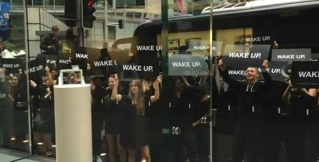

 

I ain't kidding! This one is really one of the cheapest publicity stunts by Samsung (?) as part of anti-Apple protest. A campaign marked by words "**Wake Up**" is running here and around to launch the mystery product in Australia.

A black bus branded ‘Wake up.’ saw people chant the slogan and wave placards outside the store, which was recorded by video blogger Nate “Blunty” Burr who claimed to have been at the venue by coincidence outside Apple's retail outlet in Sydney, Australia.

 

Australian site [Bannerblog](http://www.bannerblog.com.au/news/2012/04/what_is_wake_up_australia.php) believes the stunt was conceived by Tongue, a local creative shop, in order to raise awareness ahead of an upcoming Galaxy S III launch, Samsung’s latest and greatest would-be iPhone killer (so called!).

Is this insulting marketing even legal at first place?

 

<iframe src="http://www.youtube.com/embed/Ldq2tNLRDwA" frameborder="0" width="560" height="315"></iframe>

 

Well, this is not the only campaign which is running around right now in Australia. Go to [tgeltaayehxnx.com](http://www.tgeltaayehxnx.com/) which is the anagram for 'the new galaxy' which ultimately redirects to [thenextgalaxy.com](http://www.thenextgalaxy.com/). If you carefully refer the tagline in the first website - _'Following technology blindly often gets you nowhere',_ is this is not part of all marketing? The second website reveals the teaser video to join the Samsung Mobile at Unpacked 2012 which is going to happen on May 3, 2012.

The following commercial refers all iPhone users to mindless sheep - huh - **iSheep**? Who cares Samsung?

 

<iframe src="http://www.youtube.com/embed/8NnVU8R6mAU" frameborder="0" width="560" height="315"></iframe>

 

The same Australian blog reports that there is one more website campaign ([wake-up-australia.com.au](http://wake-up-australia.com.au/)) running down a countdown timer with the same **Wake Up** words. The countdown stops around May 3 or 4 which is the Samsung event date.

**Update** - A spokesperson for the Samsung denied involvement in the Wake Up bus campaign, telling [SlashGear](http://www.slashgear.com/samsung-denies-staging-wake-up-anti-apple-flashmob-27225067/): _"Samsung Electronics Australia has nothing to do with the ‘Wake-Up' campaign."_

Hell, yeah? What do you think of all this marketing campaign? Another great ad by Samsung? Or it was pretty good? Are you tired of all these anti-Apple ads? Rubbish? Let us know in the comments section below.
