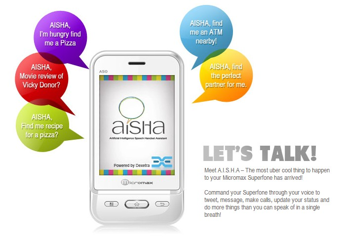

 

Meet AISHA - a desi counterpart hoping to compete with Apple's [Siri](http://icosmogeek.com/the-story-behind-siri-its-name-and-founder/) feature. If you are in love with Apple's Siri feature and had wished if something like that was available on a cheaper mobile market, here is a new announcement from Micromax India Mobile.

Micromax announced the launch of new **A50 Ninja** mobile device, which comes with an Artificial Intelligence Speech Handset Assistant, "AISHA".

The device comes with Android 2.3.6 (Gingerbread) with a processor of 650 MHz, dual SIM and priced at Rs. 4999 (that's around $100).  Other tech specs include connectivity features such as Wi-Fi, GPRS, Bluetooth, Gravity Sensor, a 2.0MP camera and expandable memory up to 32GB.

Through the voice recognition tool **AISHA**, users can initiate a Google search, view stock market details, know phone status, movie reviews, make calls, read news of desired locations, know horoscopes, make language translations and also view recipes. AISHA helps you to inquire your missed calls, send message, inquire date and time, weather conditions, pose knowledge questions and a number of jobs to count on. Also, Micromax has back-end tie up with Indian portals such as Timesjob.com, Simplymarry.com etc for this voice intelligent service.

Do you consider buying this device? At least for the tempting price?

\[[Read more about AISHA](http://micromaxsuperfone.com/products/aisha.html)\]
