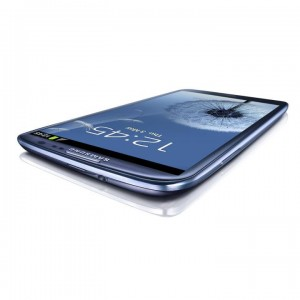
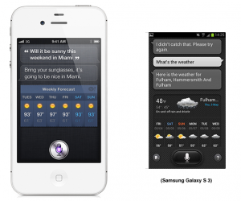

Samsung Galaxy S III is official now. The company unveiled the new device few minutes ago in UK Earls Court Exhibition Centre. With all the speculations about the new innovative features, there is one feature to be pointed out. The 'New S Voice Feature' in the device just exactly looks like Apple's Siri feature in iPhone 4S.

More about this new 'innovative' feature after the technical specifications of the device.

 

The device features 4.8-inch Super AMOLED HD display, 8-Megapixel camera with zero shutter lag, 1.4GHz Samsung Exynos 4 Quad processor, 1GB of RAM, 2,100 mAh battery, a MicroSD card slot and it runs Android 4.0 Ice Cream Sandwich. It comes in Blue and White with 16 GB, 32 GB and 64 GB storage options.

Other features

> New TouchWiz calling it as Nature UX
> 
> 50 GB Bundle storage with Dropbox for 2 years
> 
> Voice recognition feature called 'S Voice'
> 
> S-Beam, NFC feature related to WiFi technology
> 
> Pop up Play - picture in picture functionality
> 
> Wireless charger (?)
> 
> Smart Stay - facial recognition feature

 

Lastly, the top feature in the list is the so called 'innovative' voice recognition feature - **S-Voice**. It just looks like Apple's popular Siri. See the comparison below in the picture \[[Credit](https://twitter.com/#!/sdw/status/198117105403559936)\]. Here, on the left is Apple's Siri and the right is the **S Voice** copycat

 

Let us know about this new device and new features in the comments section. Here is a bonus video of the new product!

<iframe src="http://www.youtube.com/embed/2lpLGb1WW8E?feature=player_embedded" frameborder="0" width="640" height="360"></iframe>
