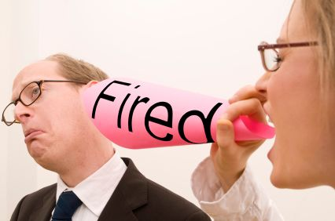

 

Forbes listed 5 CEOs that deserve being fired. In that list, [Microsoft  CEO Steve Ballmer](http://icosmogeek.com/developers-developers-developers-by-steve-ballmer/) is the "worst CEO of a large publicly traded American company today." Ballmer, according to Forbes, has destroyed shareholder value and jobs at Microsoft and "singlehandedly steered Microsoft out of some of the fastest growing and most lucrative tech markets." He's also seen the company's share price drop from $60 when he took over more than 10 years ago to its current price in the low $30s.

Forbes thinks that although he’s #19 on Forbes list of billionaires, Ballmer should not be allowed to take such incredible risks with investor money and employee jobs.  Best he be retired to enjoy his fortune rather than deprive investors and employees of building theirs. In the past, there were [speculations](http://icosmogeek.com/bill-gates-coming-back-to-microsoft-investors-not-happy-with-steve-ballmer/) that Bill Gates would be coming back to Microsoft.

 

 

The [Forbes article](http://www.forbes.com/sites/adamhartung/2012/05/12/oops-5-ceos-that-should-have-already-been-fired-cisco-ge-walmart-sears-microsoft/) starts with the discussion about recent chaos about Yahoo's CEO Scott Thompson. Thompson is set to step down, in what will be a dramatic end to a controversy over a fake computer science degree that he had on his biography. Later, Yahoo announced Fred Amoroso as Chairman of the Board of Directors and Ross Levinsohn as interim Chief Executive Officer, effective immediately.

The post then listed 5 CEOs that deserve being fired for various reasons.

> #5 - John Chambers (Cisco Systems)
> 
> #4 - Jeffrey Immelt (General Electric - GE)
> 
> #3 - Mike Duker (WalMart)
> 
> #2 - Edward Lampert (Sears)
> 
> #1 - Steve Ballmer (Microsoft)

There were a lot of CEO departures in 2012.  Research in Motion, Best Buy and American Airlines are three examples. Share your opinion on this article.
