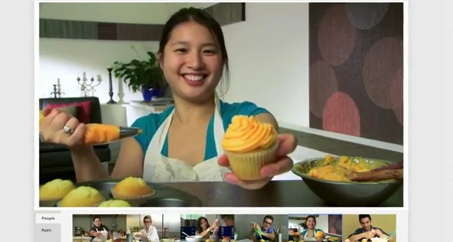
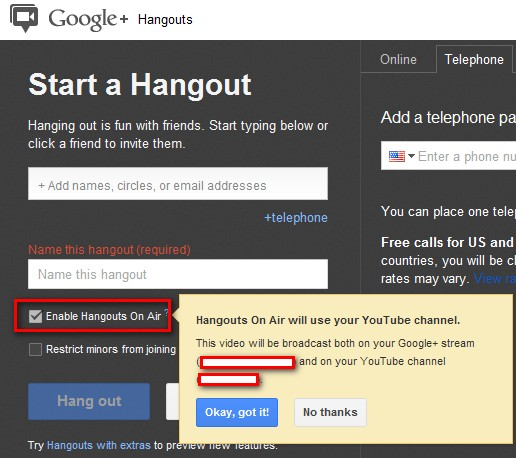
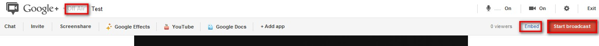

Google+ now allows you to live broadcast your video on air and simultaneously on YouTube with just few simple steps. You can stream your content publicly on your Google+ profile, your YouTube channel and also on your blog/website.

The feature is called Hangouts On Air, which has been available to selected users for a while, but is only now being released for general use. The ability to use Hangouts On Air will be rolling out to everyone over the next few weeks. You can also plan to stream your content like birthday, marriage or other occasions. As of now, this will broadcast publicly everything.

 

The idea of streaming live video is not new, services like [Ustream](http://www.ustream.tv/) or [Qik](http://qik.com/) already offer similar services but it is the unique feature Google offers social integration and also you can directly stream and save it later in your YouTube channel.

1. Head over [Hangouts on Air](http://www.google.com/+/learnmore/hangouts/onair.html) and sign in with your Google account. Once you click 'Start now' button, you will be presented with the following screen.
2. Type in your circle name or email addresses in the first field. Name the hangout and check the box **'Enable Hangouts on Air'.** Read out the YouTube channel information and click **'Hang out'**.
3. Once you are in the Hangout page, by default it will not broadcast.  In the below screenshot, you can see many options which shows the status of your Hangout from which you will find a link to embed on your website or blog and also the YouTube link to share with public.
4. Once you are all set with your initial styling at your end, click 'Start broadcast'
5. Click Ok in the next warning which tells you that it will broadcast publicly. Once your broadcast is over a recording of the broadcast will automatically replace the live player so that people who miss the live broadcast can still view it.
6. Once the hangout is finished, you can end the broadcast and your recording will now be uploaded to your YouTube channel.

Will you be using this feature for streaming your content like marriage, birthday and other occasions? Do you consider privacy settings?

Watch below video for more details -

 

<iframe src="http://www.youtube.com/embed/ohlHn6Kt5YM" frameborder="0" width="560" height="315"></iframe>
