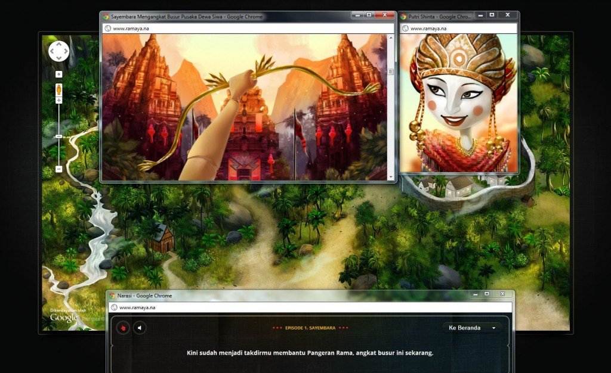
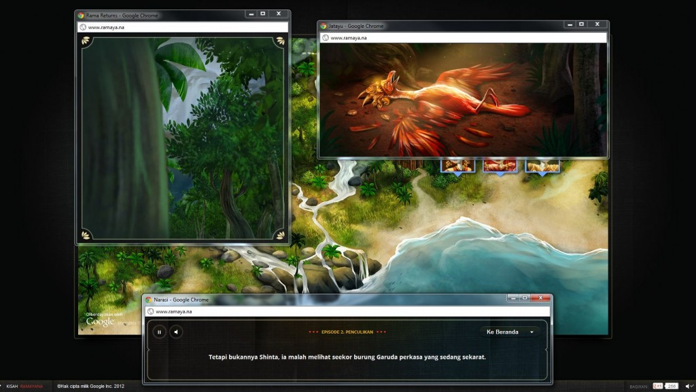
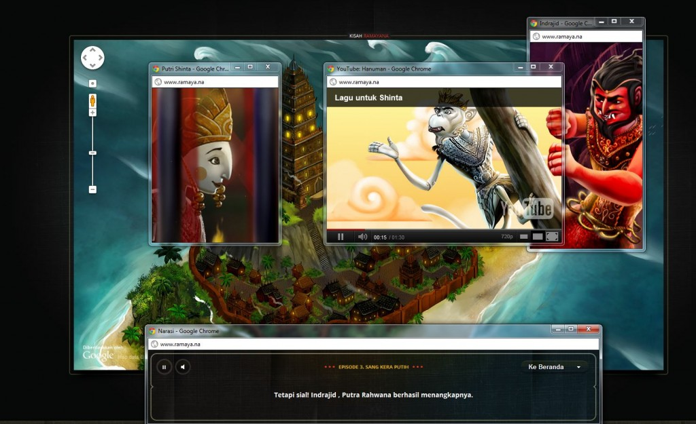
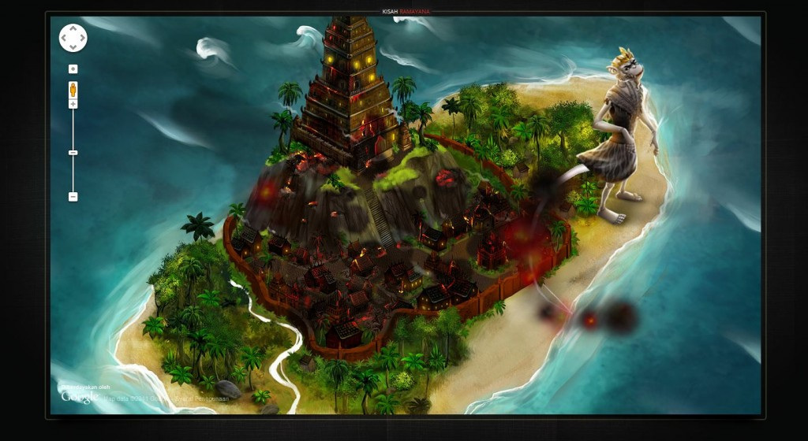

Google Indonesia has created an awesome and pretty sweet Chrome experiment that tells the story of Ramayana in an interactive visualization in a digital way. The story is the same classic Sanskrit epic but the characters Ram, Sita, Ravan and Hanuman use modern Google tools like Google Talk, Maps, G+, Docs, Weather, Gmail, Product search and other Google tools in this showcase. As the story goes on, Jatayu even writes a blog!

Chrome Experiments is a showcase for creative web experiments, the vast majority of which are built with the latest open technologies, including HTML5, Canvas, SVG, and WebGL. All of them were made and submitted by talented artists and programmers from around the world.

 

The visuals are gorgeous enough with a splendid music playing throughout the episodes. The experiment obviously works smooth in Google Chrome (you can give it a try in Firefox and IE, but I am sure you will not experience the full smoothness). When you launch the website, you might be surprised to find new Chrome windows use Google products and it is not just an usual animation with a running story. You will have to interact with the browser to move along. For example, in the above screenshot, I had to move my mouse along the browser scroll bar to lift 'Shivadhanush' in 'Swayamvaram' episode.

I have captured few screenshots, but head to **[Ramaya.na](http://www.ramaya.na/)** to try out yourself and enjoy this creativity. The script is written in Bahasa Indonesia but if you are slightly familiar with the original Ramayana, you’ll get through easily. This is not yet available in English or other International languages.

 

 

