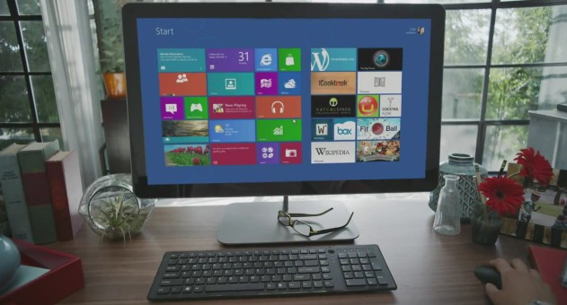

Along with the news about [Windows 8 Release Preview](http://icosmogeek.com/windows-8-release-preview-is-now-available-for-download/) download availability earlier today, Microsoft also confirmed the price details for Windows 8 upgrade. It costs only $14.99  for Windows 8 Pro edition upgrade, but only if you buy a new Windows 7 PC  between this Saturday, June 2, 2012 and Jan 31, 2013. Microsoft will offer the deal to computer buyers in 131 markets, including the U.S. and Canada.

In the Windows Experience [blog post](http://windowsteamblog.com/windows/b/windowsexperience/archive/2012/05/31/the-windows-8-release-preview-amp-windows-upgrade-offer-windows8.aspx), Microsoft said that more details on the upgrade plan would be announced tomorrow, and that further upgrade options will be revealed for current Windows 7 computer owners in the coming months.

> For Consumers:
> 
> Are you really excited about all the new PCs available today but thinking about waiting for Windows 8? Well you don’t have to. We are also announcing today that starting on June 2nd, 2012, Microsoft will roll out the Windows Upgrade Offer in 131 markets including the US and Canada. Consumers who purchase eligible Windows 7 PCs that are preinstalled with Windows 7 Home Basic, Home Premium, Professional, or Ultimate and include a matching and valid OEM Certificate of Authenticity through January 31, 2013 will be able to purchase an upgrade to Windows 8 Pro for $14.99 (U.S.) which will be redeemable when Windows 8 is generally available (the program expires in February 2013). For more on the editions of Windows 8, see this blog post. When consumers register for the Windows Upgrade Offer, they will be able to download Windows 8 Pro starting the day it’s made generally available and the upgrade comes with 90 days of support from Microsoft.

This announcement was already leaked three weeks ago that the upgrade offer would launch in early summer around the time Microsoft announces Windows 8 Release Preview that happened today.

Are you excited about Windows 8 and want to try out? Head to this [link](http://icosmogeek.com/windows-8-release-preview-is-now-available-for-download/) and download Release Preview. It has got many exciting new features. Sneak peak of this next generation operating system if you haven't tried yet -

 

<iframe src="http://www.youtube.com/embed/eM5pFkNQ7no" frameborder="0" width="560" height="315"></iframe>
