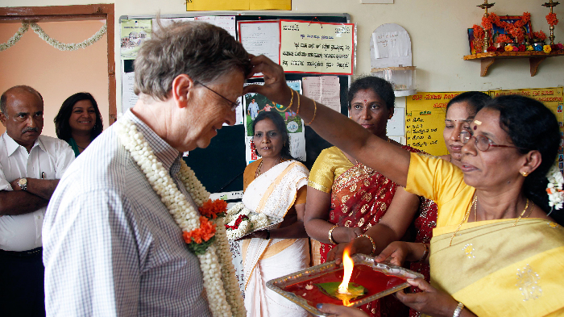

There was time when Microsoft founder Bill Gates used to visit India to promote the company's products and to engage with top authorities. Now, even after stepping down as CEO, this world's richest man hasn't stopped visiting, but he and his wife play the roles of philanthropists. Bill Gates was in India in the last week of May, 2012.

Bill & Melinda Gates Foundation has invested more than $1 billion in programs to fight disease and poverty in India and there is a lot of debate  in the UK right now about whether the country should continue giving aid to India, a country that’s no longer among the poorest in the world. Now, in a recent post in the Gates Notes website, he posted a video explaining some impeccable reasons on why he went to India recently.

Explaining more about the trip to India on the official [website](http://www.thegatesnotes.com/Topics/Health/Why-India), he mentions that he goes to India once a year to see the progress of work of Bill & Melinda Gates foundation. He further states that his foundation was originally focused mostly on preventing the spread of HIV/AIDS and its now transitioning to government sponsorship.

In a short preview video over [here](http://www.thegatesnotes.com/Topics/Health/Why-India), he started some facts that India has now gone more than a year without a new polio case and he wanted to learn about India's progress as a developer and manufacturer of vaccines.

All the facts mentioned in the official website about the trip is really inspiring and the following links will take you through the time he spent day by day:

> **[Day One, Lucknow](http://www.thegatesnotes.com/Topics/Health/Day-One-India-May-2012) -** _I just finished Behind the Beautiful Forevers, Katherine Boo’s book on the slums of Mumbai, and so was thinking about this part of the trip before I got here. I’ve been to poor areas many times, but I don’t think anything can completely prepare you for a place like Ujariaon, Uttar Pradesh. Good water is rare and open defecation is the rule. It is a stark reminder that even in the cities, there is much work to be done._
> 
> **[Day Two, Delhi](http://www.thegatesnotes.com/Topics/Health/Day-Two-India-May-2012) -** _My second full day in India started with a meeting with a high-level delegation from Pakistan of people working on eradicating polio in their country. The delegation was led by Shannaz Wazir Ali, who is Prime Minister Syed Yousaf Raza Gillani’s Special Assistant for polio eradication. I’d met her early last year in Dubai, to talk about ridding Pakistan of this terrible disease, and so it was good to catch up on progress made in the intervening months._
> 
> **[Day Three, Bangalore](http://www.thegatesnotes.com/Topics/Health/India-Day-Three) -** _My third day in India started with a visit to a community center that’s doing great work helping reduce HIV and providing support to sex workers. The day concluded with a meeting with a number of business leaders and philanthropists to talk about giving._

\[[Source](http://www.thegatesnotes.com)\]
