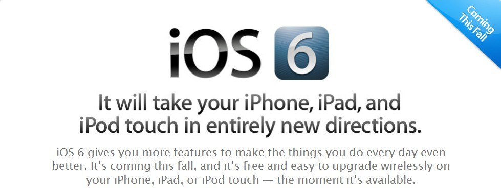
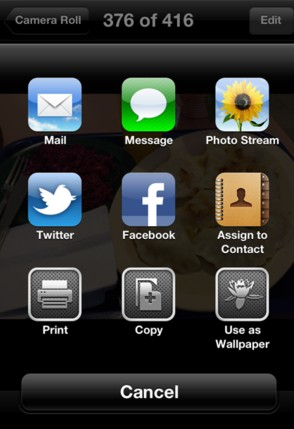
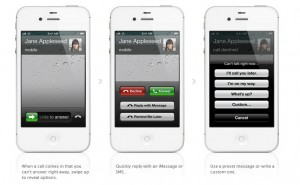
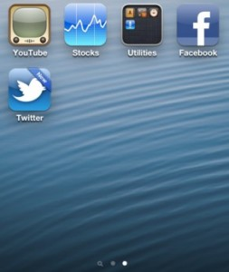

The new feature brain, iOS 6 of iPhone and iPad is about to release in this Fall and is lovelier with full of new features. It comes with over 200 features and is compatible  with iPhone 3GS, iPhone 4, iPhone 4S, iPod touch 4, iPad 2 and the new iPad. There is no support for first generation iPhone and first iPad.

With the availability of iOS 6 beta to developers, I am expecting to see lot more surface in the coming months. I managed to put all the best features in this one single post. Come back and check again for more updates.

**Maps**

Apple ditched Google Maps in iOS 6. In yesterday's keynote [announcement](http://icosmogeek.com/wwdc-keynote-summary-ios-6-news-apps-new-macs/), Apple kicked off with a Siri gimmick, she made fun of Google's Android code names, and also compared Samsung's new phone to a refrigerator.

The new Maps is vector based with visual and spoken turn by turn navigation, real time traffic updates.

**Siri -** Siri now understands more languages and is available on the new iPad. She can now open apps and you can also post updates to Facebook and Twitter.

**Facebook Integration -** You can now post directly to Facebook just like current Twitter integration. You can share photos from Camera app, location from Maps, links from Safari. Facebook contacts and birthdays are also stored directly into your OS.

**Shared Photo Streams**

**Passbook -** No more hunting through your wallet searching for gift cards, coupons, passes, or tickets. Passbook keeps everything organized and handy.

**FaceTime now works over Cellular**

**Phone -** You can now instantly reply with a message or use a preset message during an incoming call. There is also a new option 'Do Not Disturb' to forcibly put an end to all incoming calls at your desired time.

**App Store doesn't close anymore when downloading an app.**

**Custom dictionary in the cloud.**

**Status bar color changes to the app you are running.**

**Wake up to a song -** You can now select any song as alarm sound. No special app required for this.

**New skin for Music App just like OS X appearance.**

**New look for iTunes and App Store.**

**'New' mark for newly installed apps -** New apps are marked with a blue ribbon to designate their freshness.

**New Clock app in iPad.**

**Update Twitter and Facebook from Notification Center.**

**New VIP Inbox in Mail App.**

**Enhancements** **in Safari -** iCloud tabs, full screen browsing

If you have a developer account, get started by downloading iOS 6 beta from [here](https://developer.apple.com/technologies/ios6/) and let me know if you find anything new other than mentioned in this post.
