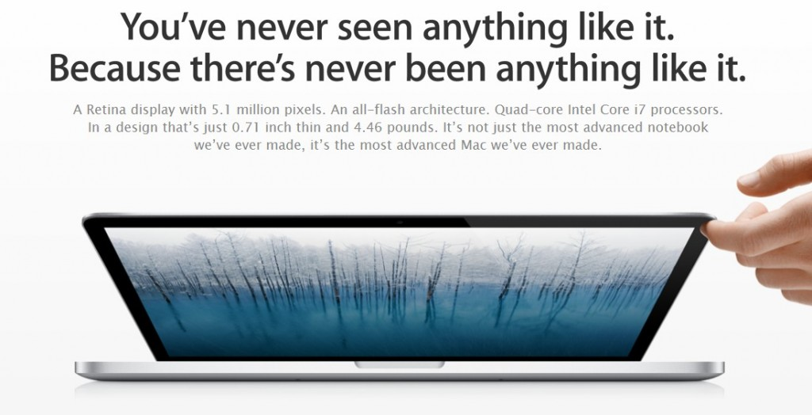

If you are feeling a bit tired of overwhelming coverage with large number of Apple announcements around tech world, Facebook, Twitter stream, then here is the quick summary of yesterday's WWDC 2012 Keynote summary. iOS 6 and a new MacBook Pro with Retina Display are the show stoppers.

**iOS 6**

This update include several bunch of new features including Siri enhancements, Facebook deep integration, FaceTime over 3G, New exclusive Maps app from Apple, shared Photo streams, new Passbook app, new App Store and lots more. I am expecting to see lot more surface in the coming months with the availability of iOS 6 beta to developers.

This update is coming this Fall and is compatible with iPhone 3GS, iPhone 4, iPhone 4S, iPod touch 4, iPad 2 and the new iPad. There is no support for first generation iPhone and first iPad.

_**Update**: [Read this post](http://icosmogeek.com/new-ios6-the-best-features-in-one-single-post/) for more notable and best features in iOS 6._

 

**New Macs**

Apple also announced and refreshed both Air and Pro models but the show stealer was the all new MacBook Pro with Retina Display. The ‘Next-Generation MacBook Pro’ features a stunning 2880 x 1800 display, which equates to a staggering 220 ppi (pixels per inch) or more than five million pixels. That’s 3 million more than an HDTV.

The new MacBook Pro with Retina Display with 15 inch 2.3 GHz costs $2199 and 2.6 GHz costs $2799. Watch the below video for the whole new vision of this amazing product:

 

<iframe src="http://www.youtube.com/embed/Neff9scaCCI" frameborder="0" width="560" height="315"></iframe>

Perhaps you just need to watch the full video over here at the official [website](http://www.apple.com/apple-events/june-2012/) if you want to catch the full fun.
