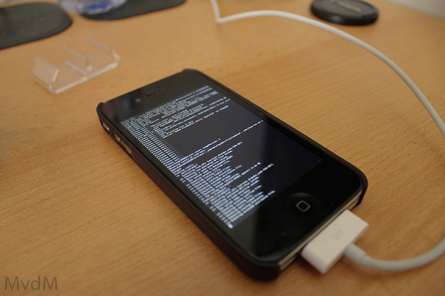

Well, the wait is over and a new fix is now available for the users stuck on 06.15.00 baseband on their iPhone 3G/3GS devices which can restore GPS functionality and as well as to use stock IPSW files again. The iPhone Dev Team announced a baseband downgrade option in Redsn0w for those who are using the iPad’s 06.15 baseband on the iPhone3G or iPhone3GS.

\[[Credit](http://www.flickr.com/photos/marknl/5694367662/sizes/z/in/photostream/)\]

Before you begin, I assume you have some knowledge about jailbreaking iPhone and this method works only on iPhone 3G/3GS running 06.15.00 baseband and will not apply to iPhone 4 or iPhone 4S users. Here are the steps from the [Dev Team](http://blog.iphone-dev.org/),

> Typically you’d have the 06.15 baseband if you unlock with ultrasn0w but updated your iPhone baseband past 05.13.04. With this new capability, you can now downgrade specifically from 06.15 to 05.13.04 (even if you never had 05.13.04 on that device before). This gives you the best of both worlds: ultrasn0w compatibility and a normal iPhone baseband with full GPS and the ability to use stock IPSWs again.
> 
> Here are the steps:
> 
> 1. Use the “Extras->Select IPSW” button in redsn0w to tell it which firmware version you have installed (new-bootrom 3GS users can usually skip this step but it doesn’t hurt for them to do it too).
> 2. Do a controlled shutdown of your iPhone (“slide to power off”). This step is very important to avoid mount problems when the ramdisk is running!
> 3. Go back to the first screen and click “Jailbreak”. Enable the “Downgrade from iPad baseband” checkbox, disable Cydia if you already have it installed, and click Next to proceed through the normal DFU ramdisk steps.
> 4. After the ramdisk gets launched and you see the Pwnapple running on your iPhone, you’ll eventually get to the “Flashing Baseband” step. THIS STEP TAKES A VERY LONG TIME to complete and there won’t be any feedback while its running. Please just let it be for the next 3-8 minutes! When the ramdisk has done its job it will reboot the phone on its own.
> 
> For those who are wondering if you can update your 3G or 3GS to 06.15 solely for the purposes of downgrading to 05.13.04, the answer is “yes” for 3G owners, and “maybe” for 3GS owners. The iPad baseband is not compatible with 3GS units manufactured week 34 of 2011 or later. If you have an iPhone3GS and if digits 3-5 of its Serial Number are 134 or later (xx134…), then you should NOT try to install the 06.15 baseband on your 3GS! It will brick your radio, preventing both the downgrade from working and normal iPhone software from using it as a phone! Be warned!

In simple steps -

1\. Download the latest redsn0w from the iPhone Dev Team’s [website](http://blog.iphone-dev.org/).

2\. Launch redsn0w.

3\. Plugin iPhone. Put into DFU mode.

4\. Go back to the first screen and click “Jailbreak”. Check “Downgrade from iPad baseband”, uncheck Cydia if you already installed it, and click Next. Just wait until you see the “Flashing Baseband” screen.

That's it! You should have a working GPS now. Let us know in the comments section if you face any issues.
