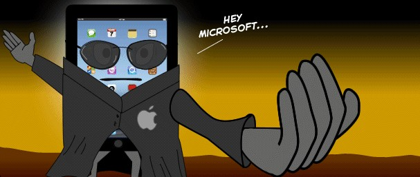
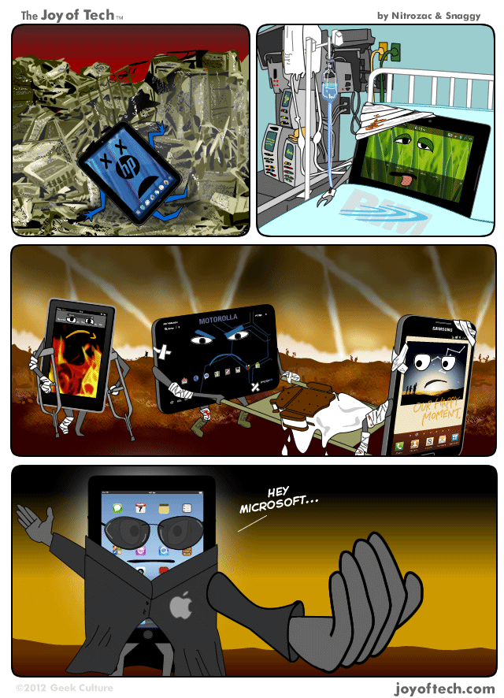

Microsoft is going to launch a tablet in a few hours. [The Verge](http://www.theverge.com/2012/6/17/3092640/microsoft-barnes-noble-tablet-andy-lees-rumor) reports that having witnessed the popularity of Amazon’s Kindle Fire, it would appear that Microsoft and Barnes & Noble have joined forces, with an entertainment tablet.

According to above sources, the Redmond giant company is set to add an Xbox 360 with a live streaming feature during today's event that is going to happen at 3:30 PM Pacific Time. Interestingly, the event location is not yet confirmed!

> Check your local time below -
> 
> Monday, June 18th:
> 
> - 03:30PM - Pacific
> - 04:30PM - Mountain
> - 05:30PM - Central
> - 06:30PM - Eastern
> - 11:30PM - London
> - 07:30AM - Tokyo (June 19th)
> - 08:30AM - Sydney (June 19th)
> - 04:00AM - IST (June 19th)

Meanwhile, enjoy this gag from the [Joy of Tech](http://www.geekculture.com/joyoftech/joyarchives/1704.html) below:

