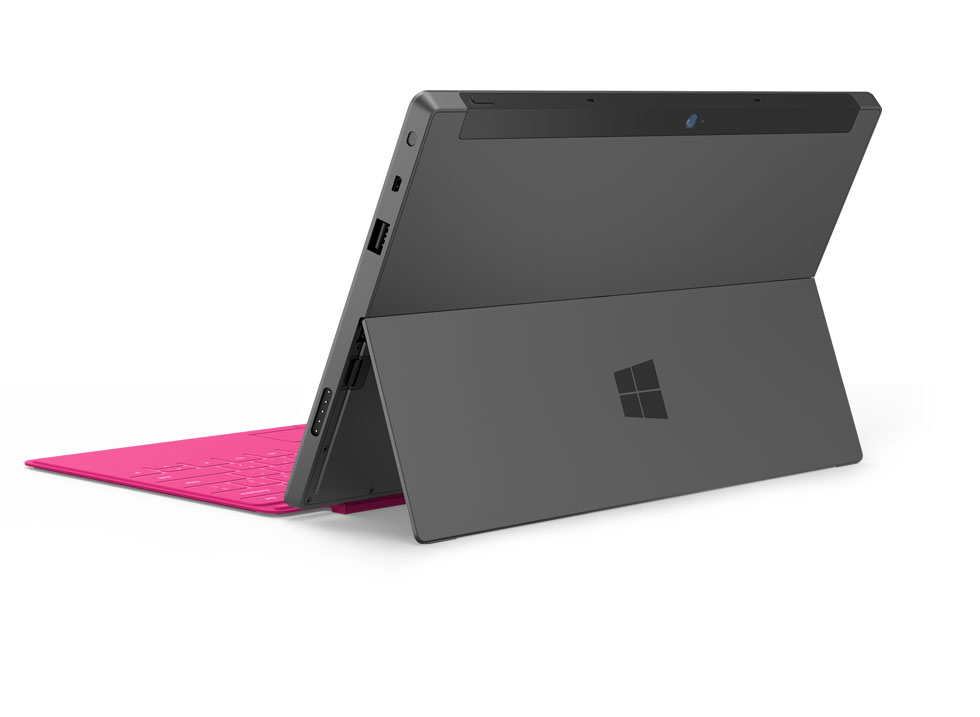

While tech media been buzzing about Microsoft's mystery [event](http://icosmogeek.com/microsoft-is-going-to-launch-a-tablet-in-a-few-hours-comic/) from past couple of days, the Redmond giant met expectations by unveiling brand new category in next generation mobile computing - Microsoft Surface. Simply put, the Surface is a Windows 8 tablet but with much more features. The device might not kill Apple's iPad, but certainly will revive Microsoft.

Steve Ballmer unveiling this new family of PCs for Windows at an event in Hollywood called this product as - "Because of Windows 8, the Surface is a PC, it is a tablet...it's something new."

Clearing all speculations, Microsoft's Surface is not a hardware from Dell or HP or something retailer company, it is Microsoft's hardware and the company do not want to take chances by giving to hardware partners, especially after a debacle of series of Android copycats. For sure, Microsoft Surface will be directly competing with iPad market if the developers are ready to develop some innovating Metro apps.

The biggest feature of this device is the 3mm thick Touch Cover (similar to iPad Smart Cover but with a full multi touch keyboard). This super thin keyboard with an integrated kick stand, VaporMg-brand molded magnesium alloy looks pretty awesome. [GeekWire](http://www.youtube.com/user/GeekWire) demonstrates this innovative keyboard in the following video:

<iframe src="http://www.youtube.com/embed/WtoIoVsH9NE" frameborder="0" width="420" height="315"></iframe>

 

There are two Windows tablets in this family as of now and breaks down as below:

1. **Surface for Windows RT** weighs in at 676 grams, and measures 9.3mm thick. It will be powered by a ARM processor and will sport a 10.6 ClearType HD Display protected by Corning Gorilla Glass. It will have a microSD card slot, USB 2.0 connection, Micro HD Video support and 2x2 MIMO antennae. It will be configured with 32gb or 64 gb models.
2. **Surface for Windows 8 Pro** will weigh in at 903 grams and measure 13.5mm thick. It will be powered by a third generation Intel Core processor and will also have a 10.6" ClearType Full HD Display protected by Corning Gorilla Glass. Windows Pro 8 will be fitted with a microSDXC slot, USB 3.0 connection, Mini DisplayPort Video and the 2x2 MIMO antennae. It will be configured in either 64gb or 128gb models.

For full detailed specifications, refer this [official document](http://www.microsoft.com/global/surface/en/us/renderingassets/surfacespecsheet.pdf).

The early hands-on reports around the tech world are praising all over and received a promising feedback. Price and availability is still unknown. Head over to [Surface.com](http://surface.com) and Press [annoucement](http://www.microsoft.com/en-us/news/press/2012/jun12/06-18announce.aspx) for more details after watching this promotional video:

 

<iframe src="http://www.youtube.com/embed/dpzu3HM2CIo" frameborder="0" width="560" height="315"></iframe>

**Update on July 31, 2012:** A brief note in Microsoft’s [latest 10-K filing](https://www.sec.gov/Archives/edgar/data/789019/000119312512316848/d347676d10k.htm) with the Security and Exchange Commission specifies October 26 as the launch day for both its radically redesigned [version of Windows](http://icosmogeek.com/official-now-windows-8-to-go-sale-on-october-26/) and the in-house-developed tablet on which it will run. And again, those are only Windows RT based tablets. The Intel based tablets are expected about 90 days after this launch.

Well, the official pricing is yet to be announced. A simple speculation could be - Windows RT products as low as $500-$600 and Windows 8 Pro Intel-based products ranging up to $1,000, or possibly higher. Your bets?
