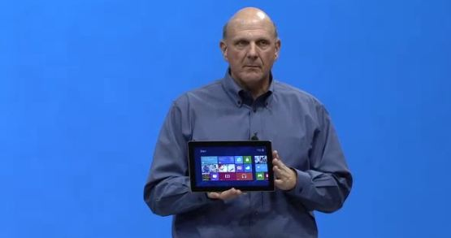

If you were not hooked up to your Facebook, Twitter and live blogging sites yesterday about Microsoft's new Surface Tablet announcement, you can now watch the [Los Angeles keynote session](http://icosmogeek.com/microsoft-surface-tablet-might-not-kill-ipad-but-revive-microsoft/) on demand below. The company did not allow live video streaming event last night, but not it has delivered the entire presentation online.

 

 

The 47.27 minute 'On-Demand Keynote: Microsoft Surface Event' video description reads - "Watch an on-demand version of the full keynote where Steve Ballmer, Steven Sinofsky and other Microsoft executives unveiled Surface, PCs built to be the ultimate stage for Windows."

Watch Online from official channel - [http://www.microsoft.com/en-us/news/presskits/windows/videogallery2b.aspx](http://www.microsoft.com/en-us/news/presskits/windows/videogallery2b.aspx)

Download Offline (286 MB) - [http://cdn-smooth.ms-studiosmedia.com/news/mp4\_mq/06182012\_Surface\_750k.mp4](http://cdn-smooth.ms-studiosmedia.com/news/mp4_mq/06182012_Surface_750k.mp4)

[The Verge](http://www.youtube.com/user/TheVerge?feature=watch) managed to put this entire video in its YouTube channel unlisted, but here is it for you -

 

<iframe src="http://www.youtube.com/embed/jozTK-MqEXQ" frameborder="0" width="560" height="315"></iframe>
