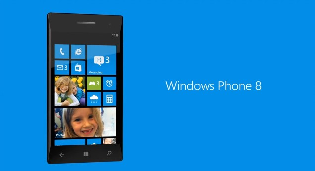

Microsoft unveiled its next version of mobile operating system - Windows Phone 8 this morning at the Windows Phone Developer summit. Many of the improvements and added features to Windows Phone 7 are now making their way back to the desktop, in the form of Windows 8.

Windows Phone 8 enhances the current version and brings some new functionalities competing directly with Apple's [iOS 6.](http://icosmogeek.com/new-ios6-the-best-features-in-one-single-post/) Unfortunately, Windows Phone 8 will not be compatible with current devices.

One of the major announcements was what they called the “Windows Core.” This means that Windows Phone 8 will share many elements of the Windows NT architecture with Windows 8 on the desktop. This includes things such as the kernel, filesystem, and device drivers. **Developers will now be able to build games for Windows 8 and Windows Phone 8 at the same time.** This shared core is the way how Apple's iOS works from the very beginning on the top of UNIX foundation of OS X.

Other updates in the event include new start screen, NFC, dual and quad core (multi core) support, more screen resolution support, Wallet, Nokia Maps, IE 10 and more. Unfortunately, existing users won't be able to upgrade to Windows Phone 8, they just have to live and upgrade to Windows Phone 7.8 update. This 7.8 update will only bring some of the user interface changes to existing devices but many of the major improvements will require new hardware. A big disappointment for even those beautiful Lumia devices!

**Summary:**

> 1. Windows Core for Windows Phone 8. As described above, it will share the same kernel, file system, media foundation, device drivers, and parts of the security model from Windows 8. A big benefit for developers.
> 2. Multi core processors
> 3. Three screen resolutions - WVGA, WXGA, and 720p
> 4. NFC - _"Google has the NFC payment part, Apple has the Passbook thing, we'll have both,"._ 
> 5. Full SD support
> 6. Improved Start Screen
> 7. Skype and voice integration
> 8. Nokia Maps

 I can talk endlessly about it but for now, here is the full presentation and official blog announcement [link](http://windowsteamblog.com/windows_phone/b/windowsphone/archive/2012/06/20/announcing-windows-phone-8.aspx) for you to enjoy. Share your thoughts and first impressions on Windows Phone 8 in the comments section.

<iframe src="http://www.youtube.com/embed/royJee1SQlY" frameborder="0" width="560" height="315"></iframe>
