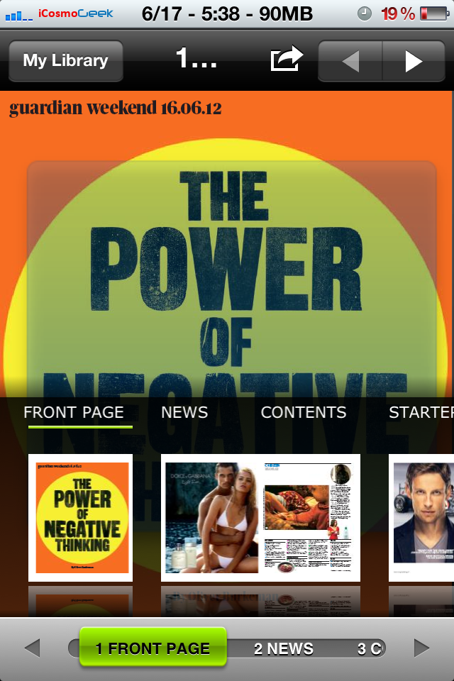

Are you a news junkie who loves to read newspapers and magazines daily? Here is an amazing digital reading app which allows you to read over 2100+ full content from 95 countries in 54 languages – all in just one single app – PressReader.

This digital newspaper kiosk app runs on iOS including the new iPad (with gorgeous Retina Display), iPhone, iPod, Android, BlackBerry, Windows Phone and Windows 7 Slate PC. The app conveniently allows technology and mobile enthusiasts to read their favorite newspaper and magazine where ever they are in the world. Some of the exclusive features of this app include landscape and portrait orientation, automatic subscriptions, zooming articles, listening to publications, social media sharing.

A spokesperson from PressReader sent me a free trial account to test the app and I spent some time downloading some newspapers and magazines on my iPhone 4S.

As you will see in the below screen shots, the newspapers and magazines looks like actual paper reading with gorgeous images. During my one week usage, the app never crashed except some sluggishness while loading heavy images.

Once I've downloaded from App Store (the app itself is free but the newspapers require subscriptions to download and read), I found it very intuitive while navigating and tapping across various options. The home screen contains the library of all the subscriptions with a 'New' mark with a green ribbon to designate the copy freshness and new edition availability.

 

 Once you tap 'Sources', all titles are presented categorized by country and by language. The app could have been better if there are more categories like 'featured', 'new arrivals', ' top sellers', 'genre', etc. in this screen.

Once you select any country or language, again, in the next screen, newspapers or magazines are categorized in various options. You can sort them in alphabetical, trending (_I assume?_) and published date as shown below:

Once you select desired newspaper or magazine, the app gives list of all publications from that publisher from which you can subscribe and read selected edition.

Once the publication is downloaded, it sits in your library of the app home screen. Notice the beautiful thumbnail view of all pages.

You really feel like you're holding the magazine or newspaper. However, the audio translation is not that great.

You can zoom in to view any page with stunning clarity.

You can instantly share an article via various available options like Email, Twitter, Facebook.

This 'Search' feature is a real life saver. You can instantly search for any news item from all papers.

In the settings screen, there is an option for you to opt out downloads over 3G if you have limited bandwidth.

The app also has unique icon notifications whenever there are new editions available to your subscriptions.

Now, to discuss the downsides of this app -  it could have been better if there are more categories like 'featured', 'new arrivals', ' top sellers', 'genre', or 'Free' in the 'Sources' screen. Even though the list of collection is huge, I do not find top sellers like 'Cosmopolitan' (There is no US edition, even though they have India edition), 'Elle', 'Forbes', 'T3' and others.

Give it a try for free on your iPhone, iPad and iPod Touch from [App Store link](http://itunes.apple.com/app/pressreader/id313904711?amp%3Bmt=8&mt=8) and let me know in the comments section how you feel using this app or if you prefer any other reading app over PressReader.

Head over to [PressReader](http://www.pressreader.com/) official website for more details, platforms and subscriptions.
