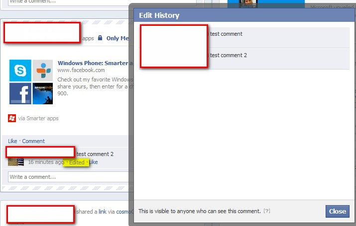
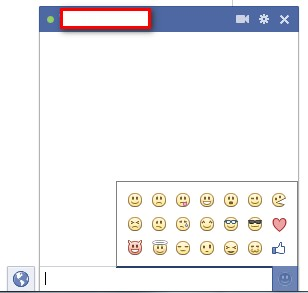

Facebook is rolling out an interesting new feature where it will allow you to edit your own comments with all viewable version history of it. If you made a mistake or want to make any changes to your comment on a post, you can now edit it instead of deleting and reposting a new comment.

\[[Credit](http://www.flickr.com/photos/robatron3000/4008795125/sizes/l/in/photostream/)\]

When you edit a comment, you'll see a note under your comment showing the time it was edited. Anyone who can see your comment can see this and click on the **Edited** link (highlighted in yellow below) to see what was changed. Facebook tells [you](https://www.facebook.com/help/?faq=105443102880679) how to do that.

Here is a sample screenshot which shows new changes:

 This feature will be useful when you comment something stupid and want to change it later. This feature is already present from long time in Google+. Interestingly, you still can't edit your original post which Google+ does, which has both advantages and disadvantages.

Do you see this new feature?

**Bonus feature update:**

Have you noticed this new thumb-up emoticon (for Like button) in your Facebook chat?

