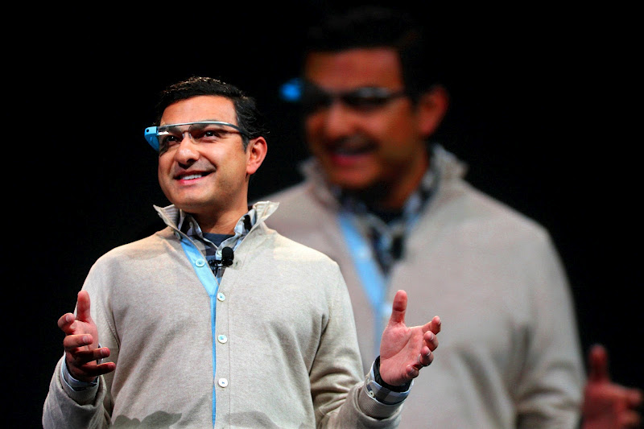
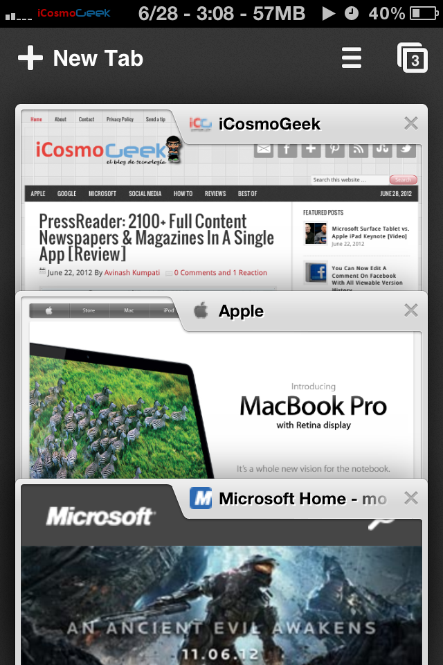
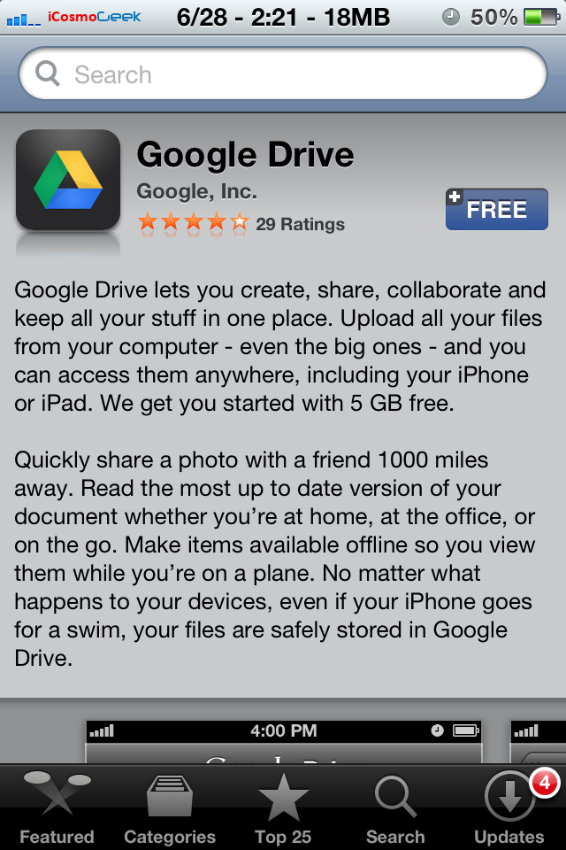

Here is the single post where you can find all the information that Google announced at Google I/O 2012 event for the past two days. We've gathered all the biggest highlights of Day 1 & 2 in this single post, including the Android 4.1 Jelly Bean, Nexus 7 Tablet, Google Glasses, and more!

 Whether you’re a fan of Android, Google products, or just good tech geek, Google I/O has it all. If you missed the announcements or are just plain curious about what Google showed off at Google I/O 2012, read on.

**Day 1:**

1. **Android 4.1 Jelly Bean -** The next version of Android which is coming to Galaxy Nexus, Xoom, Nexus S in mid-July. This update include new predictive keyboard, Google Voice Search (just like Apple's Siri), new search experience with powerful voice search and a product called “Google Now”. This 4.1 Android version also include App Encryption to developers to protect against piracy.
2. **Nexus 7 tablet -** 7″ device running Android 4.1 and made by Asus and has 1280×800 HD display. The tablet is available directly from Google Play for $199. Amazon is going to lose its Kindle low price market.
3. **Nexus Q -** This is Google's integrated answer to Apple TV but pulls content directly from cloud rather than from connected devices.  Learn more about this device [here](http://www.google.com/nexus/#/q).
4. **Google Glasses**\- This one is the real show stopper and a sheer awesomeness. It was a live footage of skydivers making their way with Google Project Glass headsets.The Project Glass hardware contains a processor, display, camera, touch pad, microphone, GPS, and various sensors. It allow users to interact with virtual world without being distracted from real world. Watch the amazing thing through 'their' eyes in the following video with a hangout in air!

<iframe src="http://www.youtube.com/embed/D7TB8b2t3QE" frameborder="0" width="560" height="315"></iframe>

Other highlights on this day include new YouTube mobile android app, 3D imagery on Google Earth for Android, Google+ Improvements, Offline support for Google Android maps.

**Day 2:**

1. **Google Chrome for iOS -** The browser include some exclusive features like tab syncing, private browsing, Google account sync against native Safari browser in iOS devices. Here is the download [link](http://itunes.apple.com/us/app/chrome/id535886823) from Apple Store.
2. **Google Drive for iOS -** The app lets you save files for offline viewing and many more. And here is the download [link](http://itunes.apple.com/us/app/google-drive/id507874739?mt=8).

3\. Offline edit support for Google docs

4\.  **Compute Engine**\- Google finally entered into cloud business game competing with Amazon EC2. Google claims supports over 1 million applications providing Linux virtual machines, on ‘Google Scale.’

If you still want to catch all the fun, the whole keynote of **Day 1** is available for viewing in the video embedded below:

<iframe src="http://www.youtube.com/embed/VuC0i4xTyrI" frameborder="0" width="560" height="315"></iframe>

Keynote video of **Day 2** is not available yet. We'll cover more posts on the product, price, feature comparison of several announcements made by Google in next few days.

If you are curious what happened exactly in last year's Google I/O 2011 event, head over to this [post](http://icosmogeek.com/google-io-2011-day-1-highlights-android-everywhere/) and have some Android fun!
