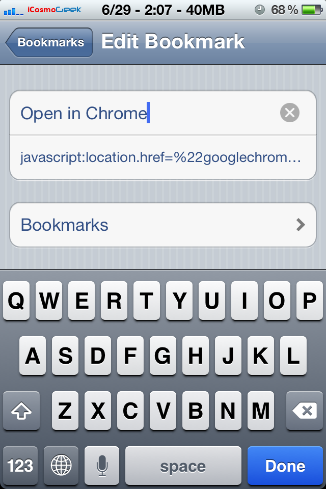

Yesterday, Google [released](https://twitter.com/k_avinash/status/218436002560217088) 'Chrome for iOS' and its already in Apple's top charts downloads. This browser brings all of the awesome features especially the user interface, Google account sync, Incognito mode, etc. Clearly, its much better browser than iOS's default Safari browser. Unfortunately, there is no option to set Chrome as default in your iOS device. This means by clicking any link will launch Safari by default and there is no such option to change. But, there is already a tweak which allows you to set Google Chrome as default browser on your iPhone, iPad or iPod Touch.

This tweak is little bit easy if you have a jailbroken device.

[](http://iCosmoGeek.com/wp-content/uploads/2012/06/Google-Chrome-for-iOS1.png)

**If your device is already Jailbroken -** 

1. Open Cydia and add navigate to Manage > Sources
2. Click 'Edit' and 'Add' new source URL - rpetri.ch/repo
3. Once the repo is added, search for 'BrowserChooser' and install (its free!)
4. Once installed, go to Settings > BrowserChooser  and select 'Chrome'
5. That't it! The tweak works pretty much as advertised by its developer Ryan Petrich on his twitter account [status](https://twitter.com/rpetrich/status/218581995708628992).
6. Now any link opened from Messages, Mail, and third party apps will directly open in Chrome browser.

 

**If your device is not Jailbroken -** 

For the devices which are not jailbroken, that means if your device has a stock OS, then here is a trick developed by [Jon Abram](http://blog.jonabrams.com/post/26099585134/open-in-chrome) that comes in the form of a bookmarklet you can stick in Safari's address bar and tap anytime you want to open the URL in Chrome.

1. Open this page (yes this page you are currently reading!) in your iOS device, obviously in Safari
2. Copy the following code

```
javascript:location.href="googlechrome"+location.href.substring(4);
```

4. Add the current page to your bookmarks by clicking arrow and 'Add Bookmark' in Safari
5. Name the bookmark something like 'Open in Chrome' and click Save
6. Now, go to your bookmarks by clicking the little book in the Safari browser. Click Edit and edit 'Open in Chrome' which is set in the previous step
7. Delete the URL that's there in it (obviously, it should be the URL that was added in Step 1) and paste the copied code (from Step 2) [](http://iCosmoGeek.com/wp-content/uploads/2012/06/Bookmarklet-Code-to-set-Chrome-as-Default-in-iOS.png)
8. That's it! Now, every time when Safari your desired URL by default, just click the bookmarklet 'Open in Chrome' which will launch the URL in Chrome directly. Its not the exact workaround, but this tweak eliminates the pain to copy manually the desired URL every time and paste in Chrome multitasking fashion.

Let's hope Apple will allow to change the defaults which may not happen in near future. Do you plan on setting Chrome as your default browser? Try out above steps and let me know if you face any issues.

By the way, you can download Google Chrome for iOS [here](http://itunes.apple.com/us/app/chrome/id535886823).
