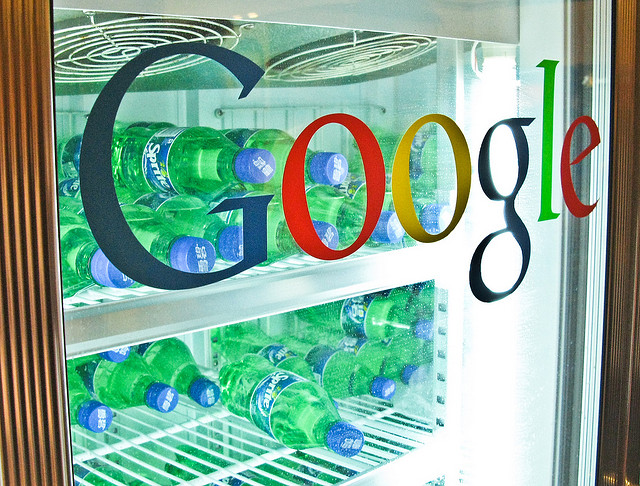

Since Larry Page [took over](http://icosmogeek.com/eric-schmidt-stepping-down-as-google-ceo-larry-page-to-replace-him/) as Google's CEO, the company is continuing its shutdown process of not so actively used products as part of Spring cleanup. Today, the company announced that it is going to shutdown few more products including Google Video, iGoogle, Google Mini and more combining to more than 30 products.

\[[Credit](http://www.flickr.com/photos/pandaray/2576981899/sizes/z/in/photostream/)\]

In an official blog post, Google [posted](http://googleblog.blogspot.com/2012/07/spring-cleaning-in-summer.html) that it is going to close Google Mini, Google Talk Chatback, Google Video, iGoogle, Symbian Search App. This is the new list of closure from the giant which add to the following that killed off in recent months -

> _Google Bookmarks Lists, Google Friend Connect, Google Gears, Google Search Timeline, Google Wave, Knol, Renewable Energy Cheaper than Coal (RE<C), Aardvark, Desktop, Fast Flip, Google Maps API for Flash, Google Pack, Google Web Security, Image Labeler, Notebook, Sidewiki, Subscribed Links,Google Flu Vaccine Finder, Google Related, Google Sync for BlackBerry, mobile web app for Google Talk, One Pass, Patent Search, Picasa for Linux, Picasa Web Albums Uploader for Mac and Picasa Web Albums Plugin for iPhoto, and all Slide products. \[[via](http://techcrunch.com/2012/07/03/google-shutdowns-continue-igoogle-google-video-google-mini-others-are-killed/?grcc=33333Z98ZtrendingZ0Z0Z0Z0Z0)\]_

Do you miss any of the above services?
