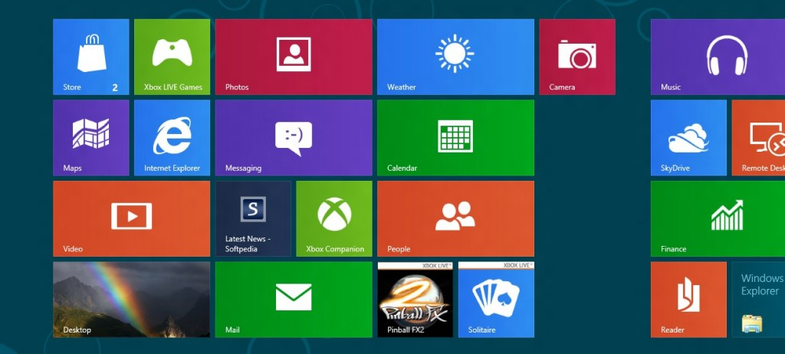

Microsoft has just announced the upgrade cost for Windows 8 Pro edition from all versions of Windows XP and above. If a user is running Windows XP, Windows Vista, or Windows 7, they’ll be able to upgrade their OS with a simple download that’ll only cost them $39.99 online or $69.99 DVD. This upgrade will be available at the same time the full cost software release is dropped.

This is the same approach Apple followed with its Lion announcement last summer.

Microsoft's upgrade promotion for Windows 8 Pro both online and at retail runs through January 31st, 2013 only. In an official blog post, Microsoft states that by buying the upgrade through its website, the Windows 8 Upgrade Assistant will walk you through the process step-by-step, making it as user friendly as possible.

This is a different deal from the already [announced](http://icosmogeek.com/microsoft-confirms-15-for-windows-8-upgrade/) $14.99 upgrade for those purchasing a new Windows PC.

\[[via](http://windowsteamblog.com/windows/b/bloggingwindows/archive/2012/07/02/upgrade-to-windows-8-pro-for-39-99.aspx)\]
