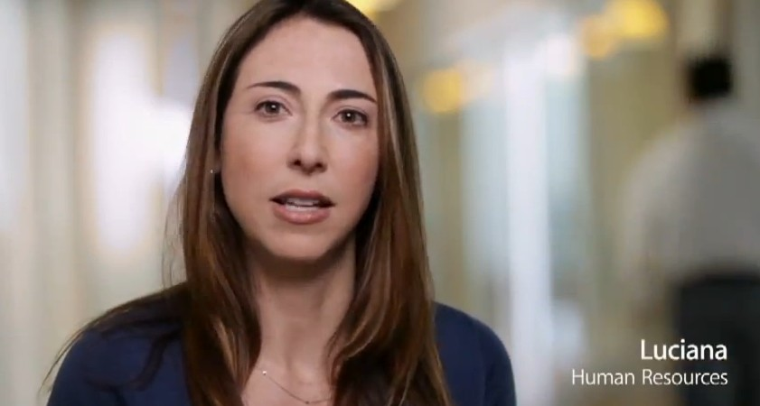

This video is definitely a worth watch for any Apple fan which tells a story of what it's like working for the world's most valuable company. This HR's employee recruiting video takes you through Apple's engineering labs, website team, creation of iPad's smart cover and more interesting things.

According to [9to5Mac](http://www.youtube.com/user/9to5vids), this Apple produced clip represents -

> _Earlier this year, Apple uploaded an interesting corporate employee recruiting video. It might just be the most in-depth tour of Apple’s Cupertino headquarters that we have ever seen on a public forum, especially Apple’s own website._

The video is narrated by Joel Podolny, Apple’s Vice President of Human Resources and Dean of Apple University. Watch the below video before Apple pulls it down.

<iframe src="http://www.youtube.com/embed/A7HVt3xgTn4" frameborder="0" width="560" height="315"></iframe>
