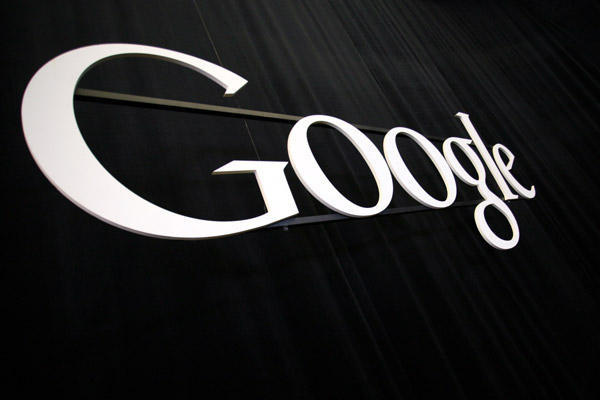

If you remember, Google was caught overriding Apple Safari browser privacy settings back in February, 2012. Now, after nine months the tech giant has a preliminary deal in place with the U.S. Federal Trade Commission (FTC) to pay a $22.5 million fine for this whole breach.

This fine could be the largest penalty on a single company by FTC. Even though it won't be a big blow for Google which draws in this sort of cash in around just five hours, but it does cast an impact over the company in terms of legal arguments and practices.

\[[Credit](http://www.flickr.com/photos/ditiidotcom/7267217432/sizes/z/in/photostream/)\]

**What happened in the past?**

Back in September, 2012, [Jonathan Mayer](http://webpolicy.org/2012/02/17/safari-trackers/), a grad student at Stanford, found that Google used hidden code to install a cookie for users of Apple’s Safari browser that allowed the search giant to intentionally cheat Safari’s privacy features and track user's browsing habits for its DoubleClick advertising business. At the time, Google said this was not intentional and that it removed the cookies from affected browsers. At that time, this was first reported by [The Wall Street Journal](http://online.wsj.com/article_email/SB10001424052970204880404577225380456599176-lMyQjAxMTAyMDEwNjExNDYyWj.html). You can read full investigation in these two hyper links mentioned in this paragraph.

**And now..**

Later, the issue became a privacy scandal as the U.S. Federal Trade Commission (FTC) said in April that it would investigate on the issue. Now, The Wall Street Journal [reported](http://online.wsj.com/article/SB10001424052702303567704577517081178553046.html) yesterday that the FTC and Google are now close to finalizing a settlement with a whopping $22.5 million fine.

According to the report -

> _The fine is expected to be the largest penalty ever levied on a single company by the U.S. Federal Trade Commission. It offers the latest sign of the FTC's stepped-up approach to policing online privacy violations, coming just six months after The Wall Street Journal reported on Google's practices._

Later today, Google has sent out a statement to [CNN](http://money.cnn.com/2012/07/11/technology/google-ftc-settlement/index.htm) which essentially has them refusing the idea that they did anything wrong. In its statement, Google emphasized that it considers the Safari episode a minor one.

> _“We cannot comment on any specifics. However we do set the highest standards of privacy and security for our users.”_ 

The search habits of users are difficult to break and it is enough to break all with a small broken trust. What do you think on this whole debacle? Is Google step a boon for Bing?  Thoughts?
